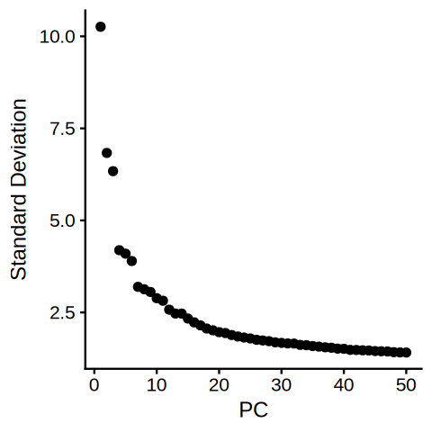
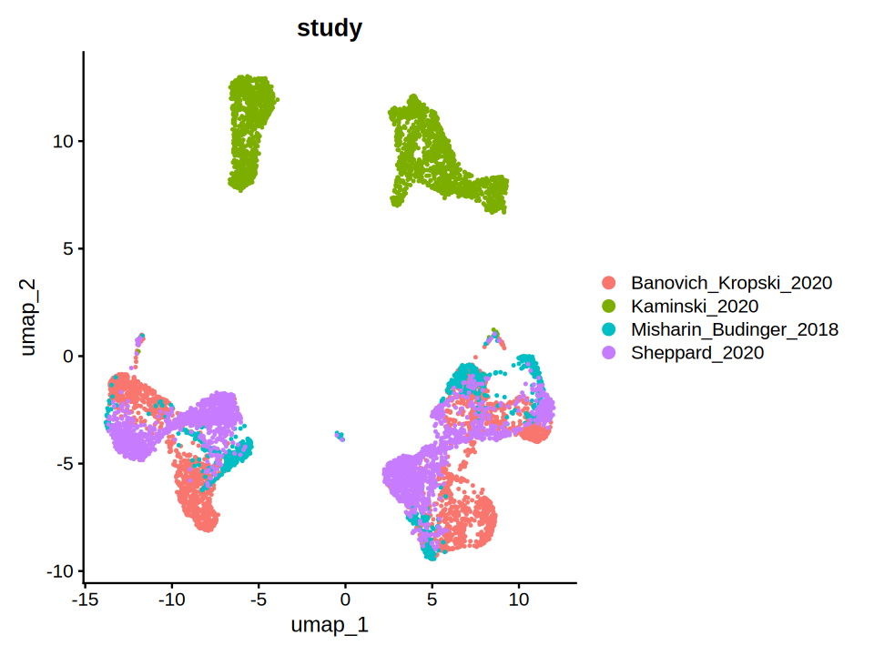
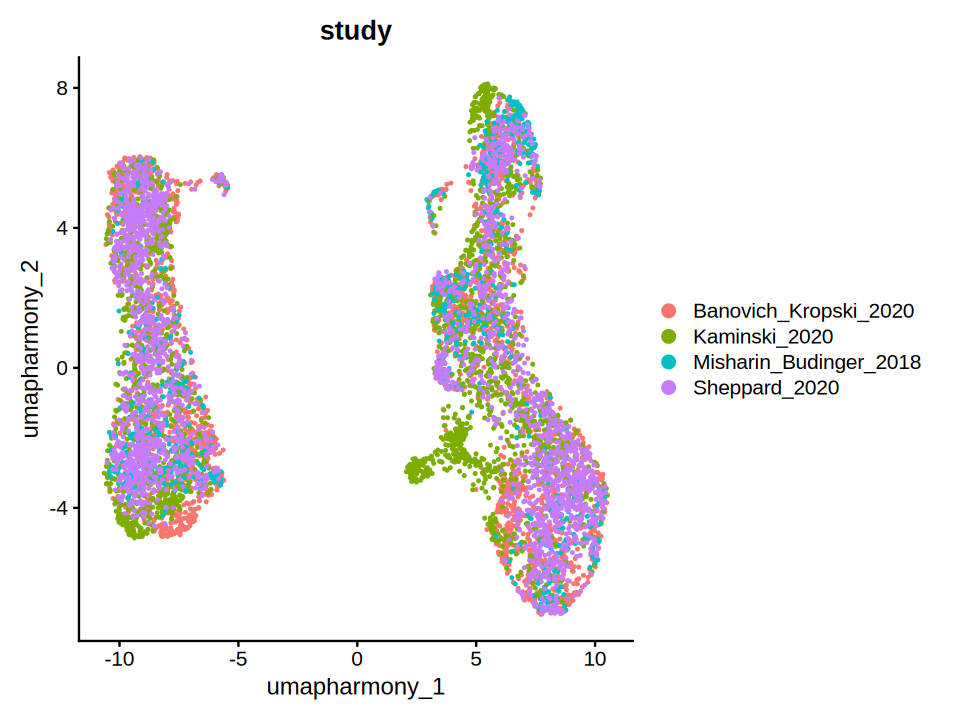
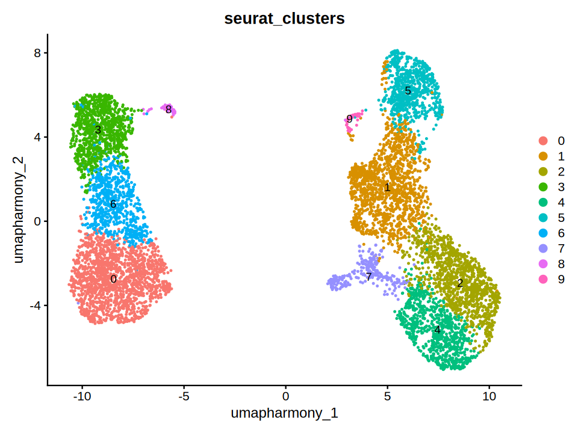
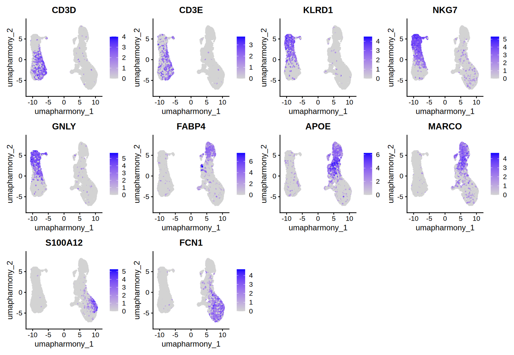
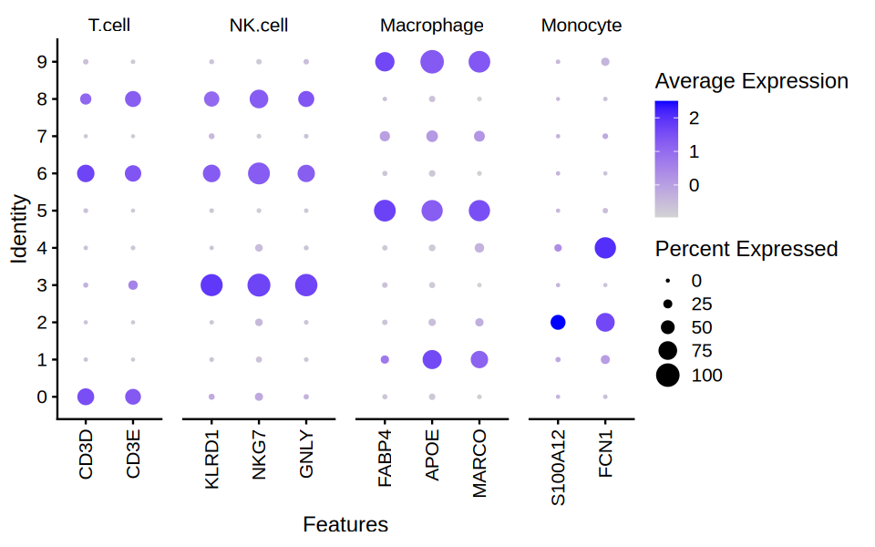
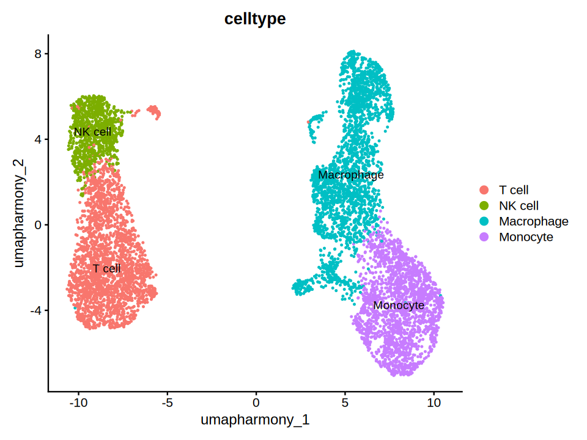
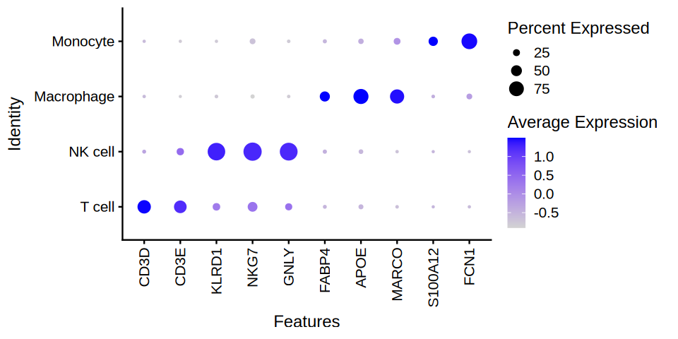
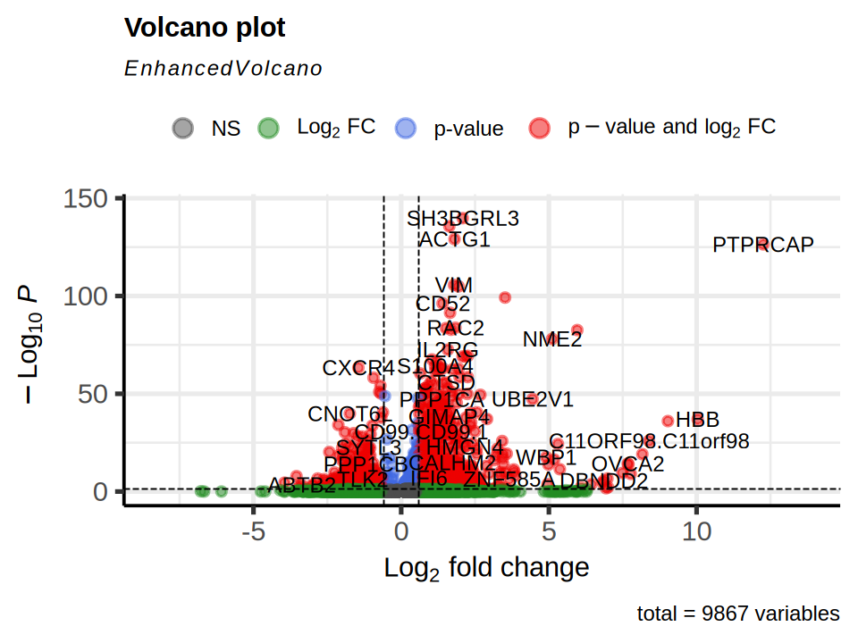

# Basic Pipeline

2026-07-21


```R
options(repr.plot.format = "png", jupyter.plot_mimetypes = c("image/png"))
```


```R
library(Seurat)
library(harmony)
library(ggplot2)

set.seed(42) # for reproducibility

data_path <- file.path("data", "basic_analysis/")
save_path <- file.path(".", "basic_analysis/")

if (!dir.exists(save_path)) {
  dir.create(save_path)
}
```

## Load data

The data used in this example is from the paper [Sikkema, L. et al. (2023)](https://doi.org/10.1038/s41591-023-02327-2).
This data can be accessed through this [collection](https://cellxgene.cziscience.com/collections/6f6d381a-7701-4781-935c-db10d30de293) on the Cellxgene platform. 
In this example however, we will use the sampled version of this data. 
Therefore, we set `min.cells` and `min.features` to 0, avoiding any further filtering.


```R
count_matrix <- read.csv(paste0(data_path, "HLCA_pulmonary_fibrosis_immune_raw.csv"), row.names = 1)
meta.data <- read.csv(paste0(data_path, "HLCA_pulmonary_fibrosis_immune_meta.csv"), row.names = 1)

# so stands for 's'eurat 'o'bject 
so <- CreateSeuratObject(counts = count_matrix, meta.data = meta.data, assay = "RNA", min.cells = 0, min.features = 0, project = "HLCA_Pulmonary_Fibrosis_immune")
# genes are in rows, cells are in columns

```


```R
head(so, n = 3)
```


<table class="dataframe">
<caption>A data.frame: 3 × 5</caption>
<thead>
	<tr><th></th><th scope=col>orig.ident</th><th scope=col>nCount_RNA</th><th scope=col>nFeature_RNA</th><th scope=col>disease</th><th scope=col>study</th></tr>
	<tr><th></th><th scope=col>&lt;fct&gt;</th><th scope=col>&lt;dbl&gt;</th><th scope=col>&lt;int&gt;</th><th scope=col>&lt;chr&gt;</th><th scope=col>&lt;chr&gt;</th></tr>
</thead>
<tbody>
	<tr><th scope=row>F01173_GCTGGGTTCCTGTAGA_haberman</th><td>HLCA_Pulmonary_Fibrosis_immune</td><td>5525</td><td>1877</td><td>pulmonary fibrosis</td><td>Banovich_Kropski_2020</td></tr>
	<tr><th scope=row>F00431_CTAGAGTCATGCCACG_haberman</th><td>HLCA_Pulmonary_Fibrosis_immune</td><td>2784</td><td>1017</td><td>pulmonary fibrosis</td><td>Banovich_Kropski_2020</td></tr>
	<tr><th scope=row>F01172_AGTAGTCGTCCGACGT_haberman</th><td>HLCA_Pulmonary_Fibrosis_immune</td><td>1617</td><td>1012</td><td>pulmonary fibrosis</td><td>Banovich_Kropski_2020</td></tr>
</tbody>
</table>


## Normalization

### Seurat style

In seurat, we can perform normalization like below.


```R
so[["RNA"]] <- split(so[["RNA"]], f = so$study)
so <- NormalizeData(so)
```

### Batch-aware feature selection

Selecting highly variable genes (HVGs) as a feature set is a common practice in single-cell RNA-seq analysis.
However, this data consists of samples across multiple studies, potentially introducing batch effects.
This kind of across-study batch effect can mask the real biological signal of interest.
To address this, we must take the batch information into account when selecting HVGs.

Here, we'll leverage this batch-aware feature implemented by `Seurat`.


```R
so <- FindVariableFeatures(so, selection.method = "vst", nfeatures = 2000)
```

## Dimensionality Reduction

Based on the HVGs selected in the previous step, we can perform dimensionality reduction using PCA.


```R
all.genes <- rownames(so)
so <- ScaleData(so, features = all.genes)
so <- RunPCA(so, features = VariableFeatures(so))
```


```R
ElbowPlot(so, ndims = 50)
```


    

    


```R
PCs <- 10

so <- FindNeighbors(so, dims = 1:PCs)
so <- FindClusters(so, resolution = 0.5)

so <- RunUMAP(so, dims = 1:PCs)
# so <- RunTSNE(so, dims = 1:PCs)
```


```R
DimPlot(so, group.by = "study")
```


    

    


## Batch Correction by Harmony

We can correct the batch effects using the method from the paper [Korsunsky, I. et al. (2019)](https://doi.org/10.1038/s41592-019-0619-0).
You can find out more about this method in its [documentations](https://portals.broadinstitute.org/harmony/articles/quickstart.html).


```R
so <- RunHarmony(so, "study")
so <- FindNeighbors(so, reduction = "harmony")
so <- FindClusters(so, resolution = 0.5) 
so <- RunUMAP(so, dims = 1:PCs, reduction = "harmony", reduction.name = "umap.harmony") # use same dimension number as before
# so <- RunTSNE(so, dims = 1:PCs, reduction = "harmony", reduction.name = "tsne.harmony")
```


```R
DimPlot(so, group.by = "study", reduction = "umap.harmony")
```


    

    


```R
DimPlot(so, group.by = "seurat_clusters", reduction = "umap.harmony", label = TRUE)
```


    

    


## Visualize marker gene expression


```R
marker.genes <- list(
    T.cell = c("CD3D", "CD3E"),
    NK.cell = c("KLRD1", "NKG7", "GNLY"),
    Macrophage = c("FABP4", "APOE", "MARCO"),
    Monocyte = c("S100A12", "FCN1")
)

FeaturePlot(so, features = unlist(marker.genes), ncol = 4, reduction = "umap.harmony")
```


    

    


```R
DotPlot(so, features = marker.genes, group.by = "seurat_clusters") +
    theme(axis.text.x = element_text(angle = 90, hjust = 1, vjust = 0.5))
```


    

    


```R
options(repr.plot.width = 8, repr.plot.height = 6)
```


```R
so$celltype <- as.character(so$seurat_clusters)
so$celltype[so$celltype %in% c(0, 6, 8)] <- "T cell"
so$celltype[so$celltype %in% c(3)] <- "NK cell"
so$celltype[so$celltype %in% c(1, 5, 7, 9)] <- "Macrophage"
so$celltype[so$celltype %in% c(2, 4)] <- "Monocyte"
so$celltype = factor(so$celltype, levels = c("T cell", "NK cell", "Macrophage", "Monocyte"))

DimPlot(so, group.by = "celltype", reduction = "umap.harmony", label = TRUE)
```


    

    


```R
options(repr.plot.width = 8, repr.plot.height = 4)
```


```R
DotPlot(so, features = as.vector(unlist(marker.genes)), group.by = "celltype") +
    theme(axis.text.x = element_text(angle = 90, hjust = 1, vjust = 0.5))
```

    Warning message:
    “Scaling data with a low number of groups may produce misleading results”


    

    


```R
so <- JoinLayers(so)
```

## Selecting patient-aware differentially expressed genes (DEGs)


```R
donor_id <- read.csv(paste0(data_path, "HLCA_pulmonary_fibrosis_donor_subset.csv"), row.names = 1)
so$donor.id <- donor_id[Cells(so), ]
```


```R
library(EnhancedVolcano)

Tcells.control <- Cells(so)[so$celltype == "T cell" & so$disease == "normal"]
Tcells.pulmonary <- Cells(so)[so$celltype == "T cell" & so$disease == "pulmonary fibrosis"]

DEG.vanilla <- FindMarkers(so, ident.1 = Tcells.pulmonary, ident.2 = Tcells.control)
```


```R
options(repr.plot.width = 8, repr.plot.height = 6)
```


```R
EnhancedVolcano(DEG.vanilla, lab = rownames(DEG.vanilla), x = "avg_log2FC", y = "p_val_adj", FCcutoff = log2(1.5), pCutoff = 0.05)
```

    Warning message:
    “Using `size` aesthetic for lines was deprecated in ggplot2 3.4.0.
    ℹ Please use `linewidth` instead.
    ℹ The deprecated feature was likely used in the EnhancedVolcano package.
      Please report the issue to the authors.”
    Warning message:
    “The `size` argument of `element_line()` is deprecated as of ggplot2 3.4.0.
    ℹ Please use the `linewidth` argument instead.
    ℹ The deprecated feature was likely used in the EnhancedVolcano package.
      Please report the issue to the authors.”


    

    


    R version 4.5.3 (2026-03-11)
    Platform: x86_64-conda-linux-gnu
    Running under: Ubuntu 24.04.4 LTS
    
    Matrix products: default
    BLAS/LAPACK: /opt/conda/lib/libopenblasp-r0.3.33.so;  LAPACK version 3.12.0
    
    locale:
     [1] LC_CTYPE=C.UTF-8       LC_NUMERIC=C           LC_TIME=C.UTF-8       
     [4] LC_COLLATE=C.UTF-8     LC_MONETARY=C.UTF-8    LC_MESSAGES=C.UTF-8   
     [7] LC_PAPER=C.UTF-8       LC_NAME=C              LC_ADDRESS=C          
    [10] LC_TELEPHONE=C         LC_MEASUREMENT=C.UTF-8 LC_IDENTIFICATION=C   
    
    time zone: Etc/UTC
    tzcode source: system (glibc)
    
    attached base packages:
    [1] stats     graphics  grDevices utils     datasets  methods   base     
    
    other attached packages:
    [1] EnhancedVolcano_1.28.2 ggrepel_0.9.8          future_1.70.0         
    [4] ggplot2_4.0.3          harmony_2.0.5          Rcpp_1.1.1-1.1        
    [7] Seurat_5.5.0           SeuratObject_5.4.0     sp_2.2-1              
    
    loaded via a namespace (and not attached):
      [1] deldir_2.0-4           pbapply_1.7-4          gridExtra_2.3         
      [4] rlang_1.2.0            magrittr_2.0.5         RcppAnnoy_0.0.23      
      [7] otel_0.2.0             spatstat.geom_3.8-1    matrixStats_1.5.0     
     [10] ggridges_0.5.7         compiler_4.5.3         png_0.1-9             
     [13] systemfonts_1.3.2      vctrs_0.7.3            reshape2_1.4.5        
     [16] stringr_1.6.0          pkgconfig_2.0.3        crayon_1.5.3          
     [19] fastmap_1.2.0          labeling_0.4.3         promises_1.5.0        
     [22] ragg_1.5.2             purrr_1.2.2            jsonlite_2.0.0        
     [25] goftest_1.2-3          later_1.4.8            uuid_1.2-2            
     [28] spatstat.utils_3.2-3   irlba_2.3.7            parallel_4.5.3        
     [31] cluster_2.1.8.2        R6_2.6.1               ica_1.0-3             
     [34] stringi_1.8.7          RColorBrewer_1.1-3     spatstat.data_3.1-9   
     [37] limma_3.66.0           reticulate_1.46.0      parallelly_1.47.0     
     [40] spatstat.univar_3.2-0  lmtest_0.9-40          scattermore_1.2       
     [43] IRkernel_1.3.2         tensor_1.5.1           future.apply_1.20.2   
     [46] zoo_1.8-15             base64enc_0.1-6        sctransform_0.4.3     
     [49] httpuv_1.6.17          Matrix_1.7-5           splines_4.5.3         
     [52] igraph_2.3.2           tidyselect_1.2.1       abind_1.4-8           
     [55] spatstat.random_3.4-5  codetools_0.2-20       miniUI_0.1.2          
     [58] spatstat.explore_3.8-0 listenv_1.0.0          lattice_0.22-9        
     [61] tibble_3.3.1           plyr_1.8.9             withr_3.0.3           
     [64] shiny_1.14.0           S7_0.2.2               ROCR_1.0-12           
     [67] evaluate_1.0.5         Rtsne_0.17             fastDummies_1.7.6     
     [70] survival_3.8-6         polyclip_1.10-7        fitdistrplus_1.2-6    
     [73] pillar_1.11.1          KernSmooth_2.23-26     plotly_4.12.0         
     [76] generics_0.1.4         RcppHNSW_0.7.0         IRdisplay_1.1         
     [79] scales_1.4.0           globals_0.19.1         xtable_1.8-8          
     [82] RhpcBLASctl_0.23-42    glue_1.8.1             lazyeval_0.2.3        
     [85] tools_4.5.3            data.table_1.18.4      RSpectra_0.16-2       
     [88] pbdZMQ_0.3-14          RANN_2.6.2             dotCall64_1.2         
     [91] Cairo_1.7-0            cowplot_1.2.0          grid_4.5.3            
     [94] tidyr_1.3.2            nlme_3.1-169           patchwork_1.3.2       
     [97] presto_1.0.0           repr_1.1.7             cli_3.6.6             
    [100] spatstat.sparse_3.2-0  textshaping_1.0.5      spam_2.11-4           
    [103] viridisLite_0.4.3      dplyr_1.2.1            uwot_0.2.4            
    [106] gtable_0.3.6           digest_0.6.39          progressr_0.19.0      
    [109] htmlwidgets_1.6.4      farver_2.1.2           htmltools_0.5.9       
    [112] lifecycle_1.0.5        httr_1.4.8             statmod_1.5.2         
    [115] mime_0.13              MASS_7.3-65           

