# **Cell-Cell Interaction Analysis with CellChat**
---
2026-07-21

#### **Load library**


```R
library(Seurat)
library(CellChat)
```

#### **Load the data**


```R
seurat <- readRDS("data/cellchat/HLCA_pulmonary_fibrosis_immune_sampled.rds")
seurat
```


    An object of class Seurat 
    19354 features across 7408 samples within 1 assay 
    Active assay: RNA (19354 features, 0 variable features)
     3 layers present: counts, data, scale.data
     4 dimensional reductions calculated: pca, umap, harmony, umap.harmony


#### **UMAP visualization**


```R
options(repr.plot.format = "png", jupyter.plot_mimetypes = c("image/png", "image/jpeg"))
```


```R
ct_order <- c("Monocyte", "Macrophage", "T cell", "NK cell")
seurat$celltype <- factor(seurat$celltype, levels = ct_order)
```


```R
options(repr.plot.width = 5, repr.plot.height = 4, repr.plot.res = 200)
DimPlot(seurat, group.by = "celltype", reduction = "umap.harmony")
```


    
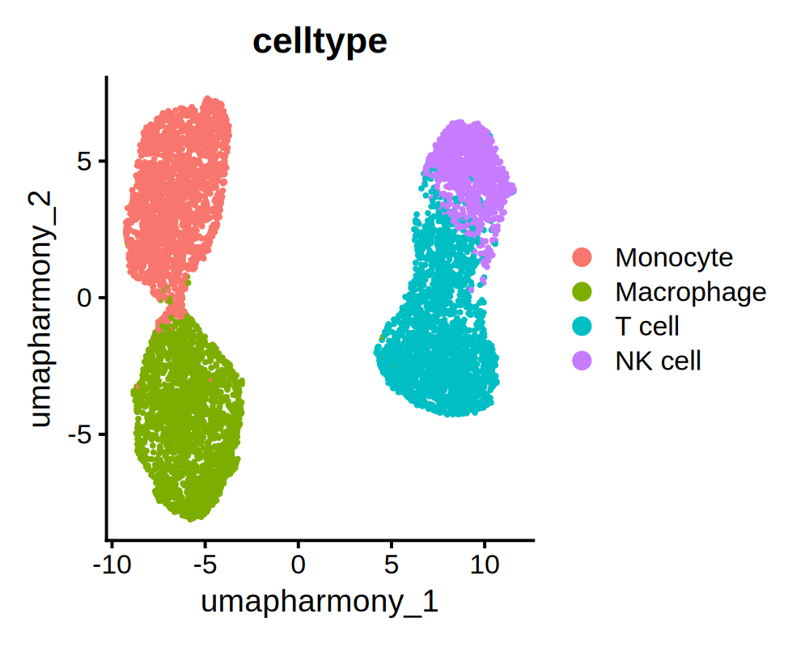
    


```R
options(repr.plot.width = 7, repr.plot.height = 4, repr.plot.res = 200)
DimPlot(seurat, group.by = "celltype", reduction = "umap.harmony", split.by = "disease")
```


    
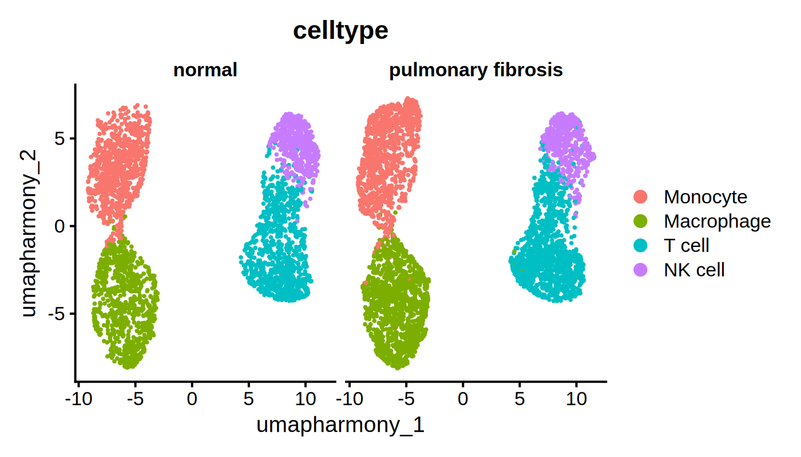
    


---
### **Input data processing**
#### **1-1. Create CellChat object from Seurat object**


```R
seurat_PF <- subset(seurat, subset = disease == "pulmonary fibrosis")
cellchat_PF <- createCellChat(object = seurat_PF, group.by = "celltype", assay = "RNA")
```

    [1] "Create a CellChat object from a Seurat object"
    The `meta.data` slot in the Seurat object is used as cell meta information 


    Warning message in createCellChat(object = seurat_PF, group.by = "celltype", assay = "RNA"):
    “The 'meta' data does not have a column named `samples`. We now add this column and all cells are assumed to belong to `sample1`! 
    ”


    Set cell identities for the new CellChat object 
    The cell groups used for CellChat analysis are  Monocyte, Macrophage, T cell, NK cell 


#### **1-2. (Do not run) Create CellChat object from expression matrix and metadata**


```R
expr <- seurat[["RNA"]]$data
meta <- seurat@meta.data

cells_PF <- rownames(meta)[meta$disease == "pulmonary fibrosis"]

expr_PF <- expr[, cells_PF]
meta_PF <- meta[cells_PF,]
meta_PF$celltype <- as.character(meta_PF$celltype)

cellchat_PF <- createCellChat(object = expr_PF, meta = meta_PF, group.by = "celltype")
```

    [1] "Create a CellChat object from a data matrix"


    Warning message in createCellChat(object = expr_PF, meta = meta_PF, group.by = "celltype"):
    “The 'meta' data does not have a column named `samples`. We now add this column and all cells are assumed to belong to `sample1`! 
    ”


    Set cell identities for the new CellChat object 
    The cell groups used for CellChat analysis are  Macrophage, Monocyte, NK cell, T cell 


#### **2. Set the ligand-receptor interaction database**


```R
CellChatDB <- CellChatDB.human # # use CellChatDB.mouse if running on mouse data
showDatabaseCategory(CellChatDB)
```


    
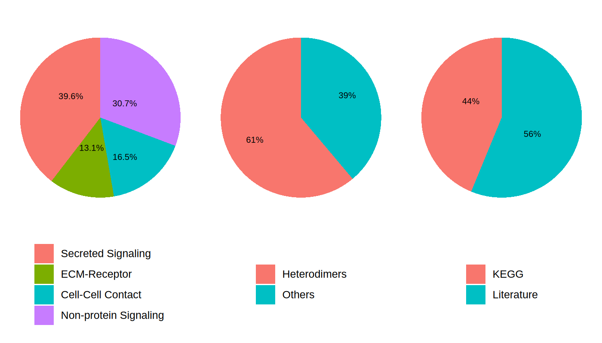
    


#### **3. Subset the expression data using CellChatDB genes**


```R
cellchat_PF@DB <- CellChatDB
cellchat_PF <- subsetData(cellchat_PF)
```

#### **4. Identify over-expressed ligands/receptors and L-R interactions in each cell group**


```R
cellchat_PF <- identifyOverExpressedGenes(cellchat_PF)
cellchat_PF <- identifyOverExpressedInteractions(cellchat_PF)
```

    The number of highly variable ligand-receptor pairs used for signaling inference is 871 


#### **5. (Optional) Smooth the gene expression because of shallow sequencing depth**


```R
cellchat_PF <- smoothData(cellchat_PF, adj = PPI.human)
```

---
### **Inference of cell-cell communication networks**
#### **1. Compute the communication probability**


```R
cellchat_PF <- computeCommunProb(cellchat_PF, raw.use = FALSE) # Set raw.use = FALSE to use the smoothed data
```

    triMean is used for calculating the average gene expression per cell group. 
    [1] ">>> Run CellChat on sc/snRNA-seq data <<< [2026-07-01 05:50:01.156411]"
    [1] ">>> CellChat inference is done. Parameter values are stored in `object@options$parameter` <<< [2026-07-01 05:51:27.089319]"


#### **2. Filter the cell-cell interaction, based on the number of cells in each group**


```R
cellchat_PF <- filterCommunication(cellchat_PF, min.cells = 0)
```

#### **3. Extract the inferred cellular communication network as a data frame**


```R
df_net_PF <- subsetCommunication(cellchat_PF)
```


```R
head(df_net_PF, 6)
```


<table class="dataframe">
<caption>A data.frame: 6 × 11</caption>
<thead>
	<tr><th></th><th scope=col>source</th><th scope=col>target</th><th scope=col>ligand</th><th scope=col>receptor</th><th scope=col>prob</th><th scope=col>pval</th><th scope=col>interaction_name</th><th scope=col>interaction_name_2</th><th scope=col>pathway_name</th><th scope=col>annotation</th><th scope=col>evidence</th></tr>
	<tr><th></th><th scope=col>&lt;fct&gt;</th><th scope=col>&lt;fct&gt;</th><th scope=col>&lt;chr&gt;</th><th scope=col>&lt;chr&gt;</th><th scope=col>&lt;dbl&gt;</th><th scope=col>&lt;dbl&gt;</th><th scope=col>&lt;fct&gt;</th><th scope=col>&lt;chr&gt;</th><th scope=col>&lt;chr&gt;</th><th scope=col>&lt;chr&gt;</th><th scope=col>&lt;chr&gt;</th></tr>
</thead>
<tbody>
	<tr><th scope=row>1</th><td>Macrophage</td><td>Macrophage</td><td>TGFB1</td><td>TGFbR1_R2</td><td>0.001743110</td><td>0</td><td>TGFB1_TGFBR1_TGFBR2</td><td>TGFB1 - (TGFBR1+TGFBR2)</td><td>TGFb</td><td>Secreted Signaling</td><td>KEGG: hsa04350</td></tr>
	<tr><th scope=row>2</th><td>Monocyte  </td><td>Macrophage</td><td>TGFB1</td><td>TGFbR1_R2</td><td>0.001484032</td><td>0</td><td>TGFB1_TGFBR1_TGFBR2</td><td>TGFB1 - (TGFBR1+TGFBR2)</td><td>TGFb</td><td>Secreted Signaling</td><td>KEGG: hsa04350</td></tr>
	<tr><th scope=row>3</th><td>NK cell   </td><td>Macrophage</td><td>TGFB1</td><td>TGFbR1_R2</td><td>0.001493103</td><td>0</td><td>TGFB1_TGFBR1_TGFBR2</td><td>TGFB1 - (TGFBR1+TGFBR2)</td><td>TGFb</td><td>Secreted Signaling</td><td>KEGG: hsa04350</td></tr>
	<tr><th scope=row>4</th><td>Macrophage</td><td>Monocyte  </td><td>TGFB1</td><td>TGFbR1_R2</td><td>0.001650336</td><td>0</td><td>TGFB1_TGFBR1_TGFBR2</td><td>TGFB1 - (TGFBR1+TGFBR2)</td><td>TGFb</td><td>Secreted Signaling</td><td>KEGG: hsa04350</td></tr>
	<tr><th scope=row>5</th><td>Macrophage</td><td>NK cell   </td><td>TGFB1</td><td>TGFbR1_R2</td><td>0.001622703</td><td>0</td><td>TGFB1_TGFBR1_TGFBR2</td><td>TGFB1 - (TGFBR1+TGFBR2)</td><td>TGFb</td><td>Secreted Signaling</td><td>KEGG: hsa04350</td></tr>
	<tr><th scope=row>6</th><td>Macrophage</td><td>T cell    </td><td>TGFB1</td><td>TGFbR1_R2</td><td>0.001648001</td><td>0</td><td>TGFB1_TGFBR1_TGFBR2</td><td>TGFB1 - (TGFBR1+TGFBR2)</td><td>TGFb</td><td>Secreted Signaling</td><td>KEGG: hsa04350</td></tr>
</tbody>
</table>


#### **4. Infer the cell-cell communication at a signaling pathway level**


```R
cellchat_PF <- computeCommunProbPathway(cellchat_PF)
```

#### **5. Calculate the aggregated cell-cell communication network**


```R
cellchat_PF <- aggregateNet(cellchat_PF)
```

#### **6. Save the CellChat object**


```R
saveRDS(cellchat_PF, file = "cellchat_lung_PF.rds")
```

---
### **Visualization**
#### **Circle plot**


```R
groupSize_PF <- as.numeric(table(cellchat_PF@idents))

options(repr.plot.width = 5, repr.plot.height = 5, repr.plot.res = 200)
invisible(
    netVisual_circle(cellchat_PF@net$weight, vertex.weight = groupSize_PF, weight.scale = T, label.edge= F)
    )
```


    
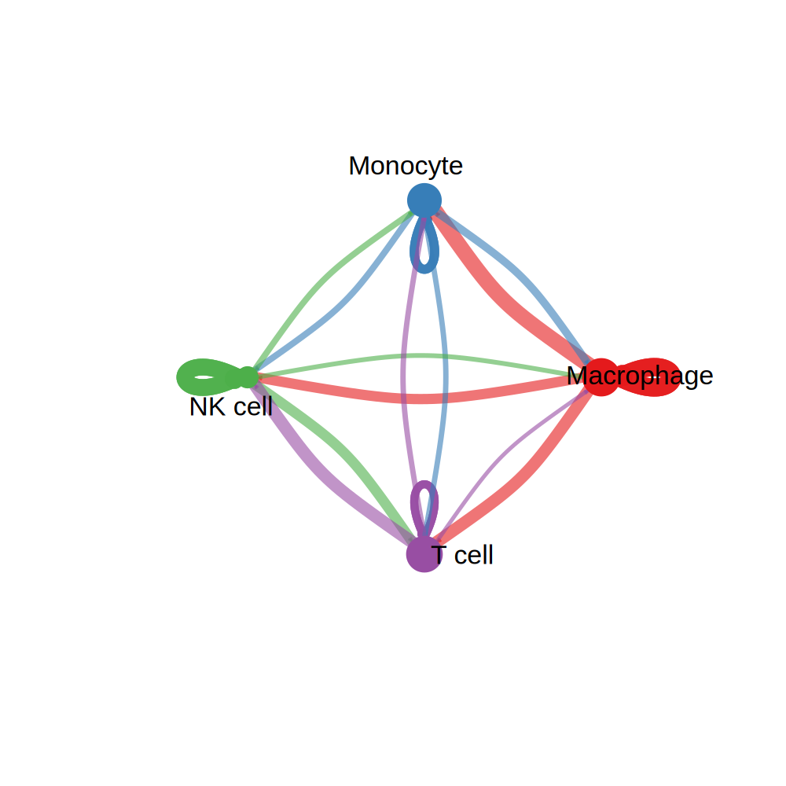
    


```R
cellchat_PF <- netAnalysis_computeCentrality(cellchat_PF, slot.name = "netP")
```


```R
names(cellchat_PF@netP$centr)
```


<style>
.list-inline {list-style: none; margin:0; padding: 0}
.list-inline>li {display: inline-block}
.list-inline>li:not(:last-child)::after {content: "\00b7"; padding: 0 .5ex}
</style>
<ol class=list-inline><li>'CCL'</li><li>'CLEC'</li><li>'GALECTIN'</li><li>'MIF'</li><li>'FN1'</li><li>'ANNEXIN'</li><li>'ICAM'</li><li>'SPP1'</li><li>'VISFATIN'</li><li>'APP'</li><li>'Prostaglandin'</li><li>'CypA'</li><li>'THBS'</li><li>'RESISTIN'</li><li>'ApoE'</li><li>'VTN'</li><li>'IL2'</li><li>'Cholesterol'</li><li>'PLAU'</li><li>'GRN'</li><li>'TGFb'</li><li>'LT'</li><li>'PECAM1'</li><li>'IL1'</li><li>'LAIR1'</li><li>'CD40'</li><li>'CD6'</li><li>'SELPLG'</li><li>'EGF'</li><li>'BAFF'</li><li>'IL10'</li><li>'COMPLEMENT'</li><li>'BTLA'</li><li>'CD96'</li><li>'IL16'</li><li>'LIGHT'</li><li>'IL6'</li><li>'CSF'</li><li>'SIRP'</li><li>'CXCL'</li><li>'CD45'</li><li>'IL4'</li><li>'IGFBP'</li><li>'CDH1'</li><li>'SEMA3'</li><li>'PVR'</li><li>'CD86'</li><li>'ApoB'</li><li>'VEGF'</li><li>'BAG'</li><li>'DHEA'</li><li>'DHT'</li><li>'SEMA4'</li><li>'TRAIL'</li><li>'CD23'</li><li>'L1CAM'</li><li>'CD48'</li><li>'PARs'</li><li>'Desmosterol'</li><li>'CD80'</li><li>'OSM'</li><li>'NRG'</li><li>'NOTCH'</li><li>'GAS'</li><li>'CD46'</li><li>'LIFR'</li><li>'ApoA'</li><li>'IGF'</li><li>'MPZ'</li><li>'FASLG'</li><li>'CDH'</li><li>'DHEAS'</li><li>'PDGF'</li><li>'EPHA'</li><li>'BMP'</li><li>'FLT3'</li></ol>


```R
pathways.show <- "TGFb"
netAnalysis_signalingRole_network(cellchat_PF, signaling = pathways.show, width = 8, height = 4, font.size = 12, font.size.title = 12)
```


    
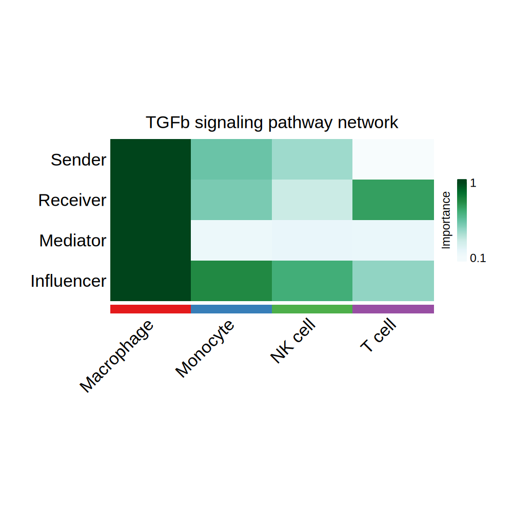
    


```R
ct_source <- c("Monocyte", "Macrophage")
ct_target <- c("T cell", "NK cell")

netVisual_bubble(cellchat_PF, sources.use = ct_source, targets.use = ct_target, signaling = pathways.show, remove.isolate = TRUE, font.size = 12)
```

    Comparing communications on a single object 
    
    


    
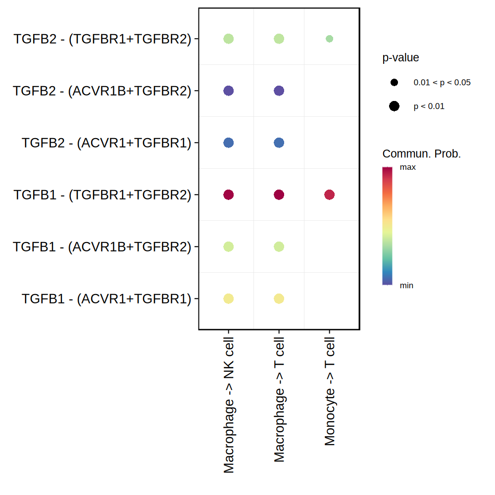
    


```R
invisible(
    netVisual_chord_gene(cellchat_PF, sources.use = ct_source, targets.use = ct_target, signaling = pathways.show)
    )
```


    
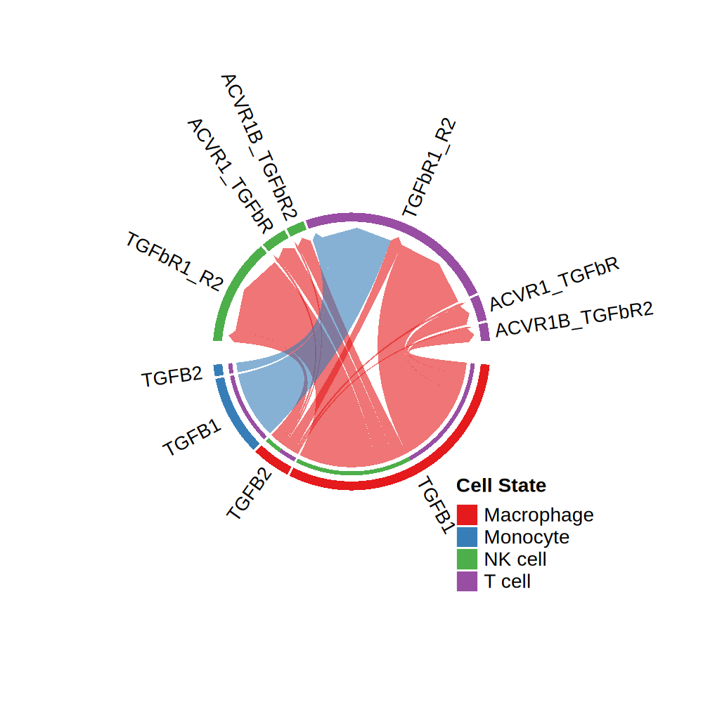
    


---
### **Process same process for normal group**
#### **1. Input data processing & Running CellChat**


```R
seurat_NM <- subset(seurat, subset = disease == "normal")
cellchat_NM <- createCellChat(object = seurat_NM, group.by = "celltype", assay = "RNA")

cellchat_NM@DB <- CellChatDB

cellchat_NM <- subsetData(cellchat_NM)

cellchat_NM <- identifyOverExpressedGenes(cellchat_NM)
cellchat_NM <- identifyOverExpressedInteractions(cellchat_NM)

cellchat_NM <- smoothData(cellchat_NM, adj = PPI.human)

cellchat_NM <- computeCommunProb(cellchat_NM, raw.use = FALSE)
cellchat_NM <- filterCommunication(cellchat_NM, min.cells = 0)
cellchat_NM <- computeCommunProbPathway(cellchat_NM)
cellchat_NM <- aggregateNet(cellchat_NM)
```

    [1] "Create a CellChat object from a Seurat object"
    The `meta.data` slot in the Seurat object is used as cell meta information 
    Set cell identities for the new CellChat object 
    The cell groups used for CellChat analysis are  Monocyte, Macrophage, T cell, NK cell 
    The number of highly variable ligand-receptor pairs used for signaling inference is 983 
    triMean is used for calculating the average gene expression per cell group. 
    [1] ">>> Run CellChat on sc/snRNA-seq data <<< [2026-07-01 05:51:42.710019]"
    [1] ">>> CellChat inference is done. Parameter values are stored in `object@options$parameter` <<< [2026-07-01 05:53:01.309]"


#### **2. Visualization**


```R
groupSize_NM <- as.numeric(table(cellchat_NM@idents))

invisible(
    netVisual_circle(cellchat_NM@net$weight, vertex.weight = groupSize_NM, weight.scale = T, label.edge= F)
    )
```


    
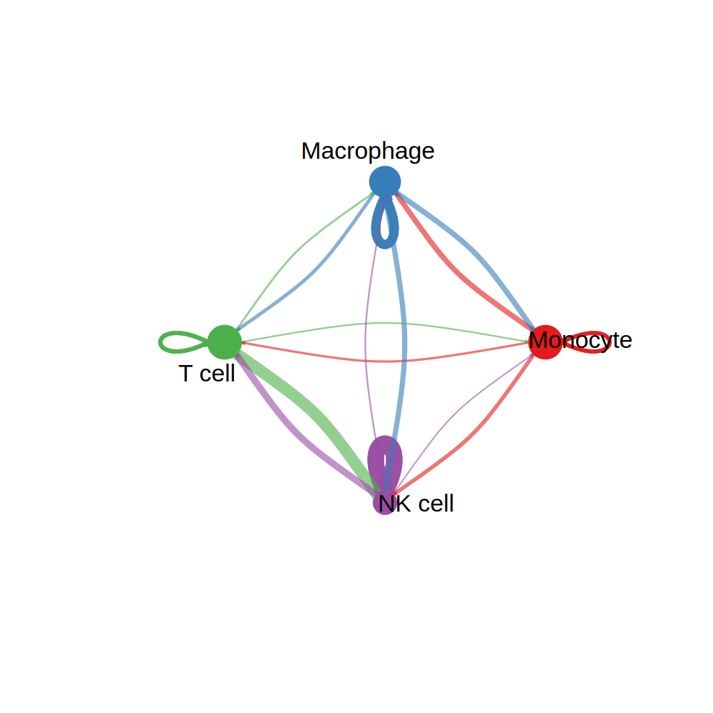
    


```R
# Compute centrality
cellchat_NM <- netAnalysis_computeCentrality(cellchat_NM, slot.name = "netP")

netAnalysis_signalingRole_network(cellchat_NM, signaling = pathways.show, width = 8, height = 4, font.size = 12, font.size.title = 12)
```


    
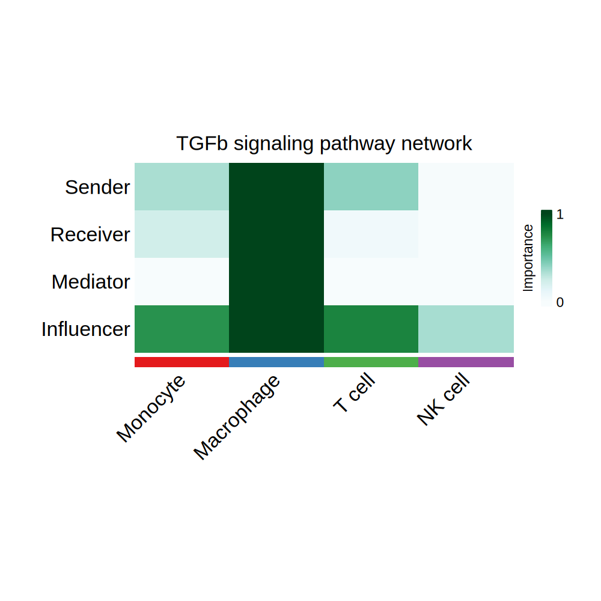
    


```R
netVisual_bubble(cellchat_NM, sources.use = ct_source, targets.use = ct_target, signaling = pathways.show, remove.isolate = TRUE, font.size = 12)
```

    Comparing communications on a single object 
    
    


    
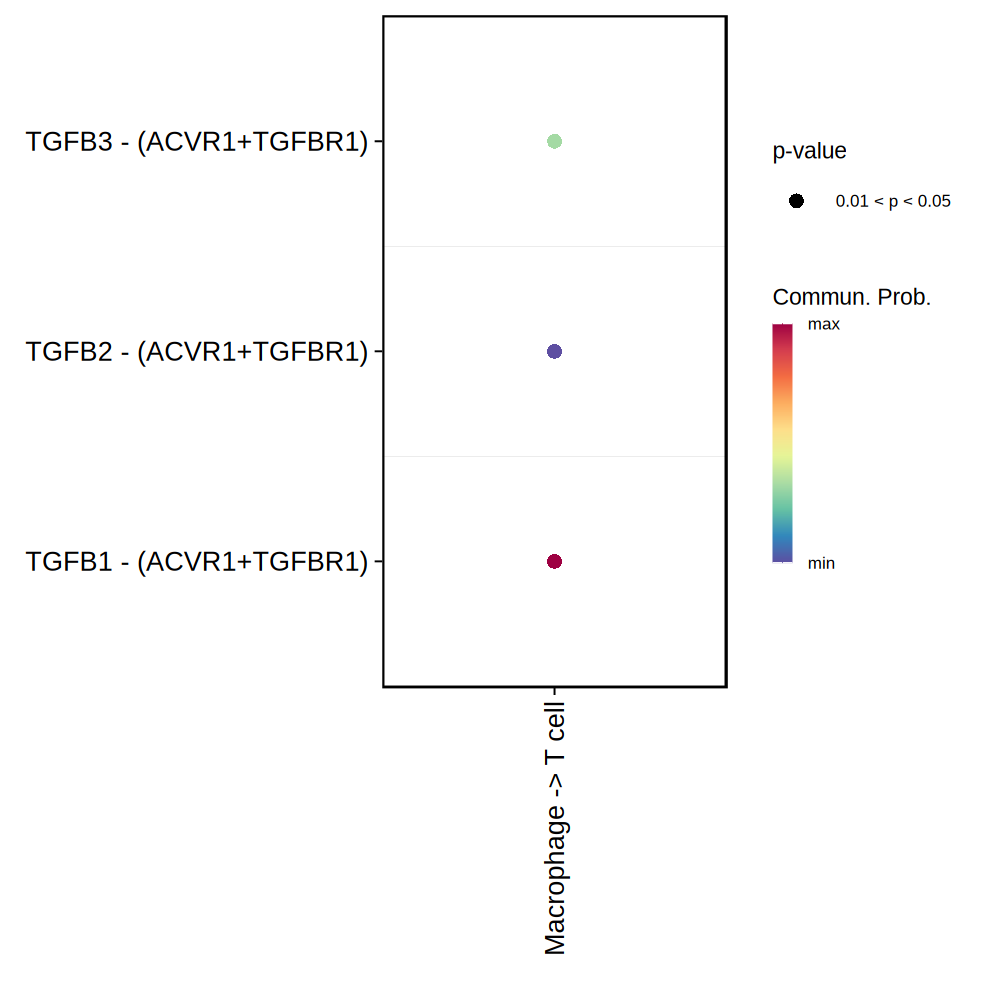
    


```R
invisible(
    netVisual_chord_gene(cellchat_NM, sources.use = ct_source, targets.use = ct_target, signaling = pathways.show)
    )
```


    
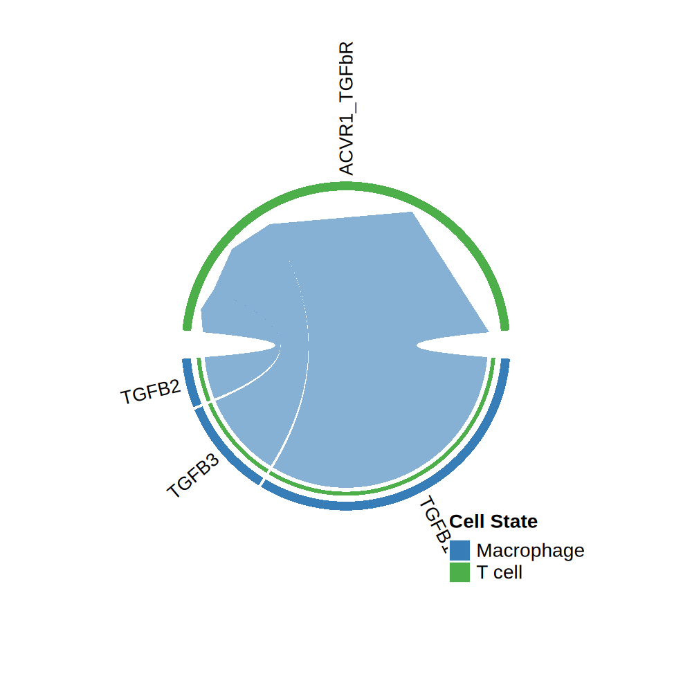
    


---
### **Reference**
Jin, S., Guerrero-Juarez, C. F., Zhang, L., Chang, I., Ramos, R., Kuan, C. H., … & Nie, Q. (2021). Inference and analysis of cell-cell communication using CellChat. Nature communications, 12(1), 1-20.

Jin, S., Plikus, M.V. & Nie, Q. (2025). CellChat for systematic analysis of cell–cell communication from single-cell transcriptomics. Nat Protoc, 20, 180–219.

Sikkema, L., Ramírez-Suástegui, C., Strobl, D.C., … & Theis, F.J. (2023). An integrated cell atlas of the lung in health and disease. Nat Med, 29, 1563–1577.


    R version 4.5.3 (2026-03-11)
    Platform: x86_64-conda-linux-gnu
    Running under: Ubuntu 24.04.4 LTS
    
    Matrix products: default
    BLAS/LAPACK: /opt/conda/lib/libopenblasp-r0.3.33.so;  LAPACK version 3.12.0
    
    locale:
     [1] LC_CTYPE=C.UTF-8       LC_NUMERIC=C           LC_TIME=C.UTF-8       
     [4] LC_COLLATE=C.UTF-8     LC_MONETARY=C.UTF-8    LC_MESSAGES=C.UTF-8   
     [7] LC_PAPER=C.UTF-8       LC_NAME=C              LC_ADDRESS=C          
    [10] LC_TELEPHONE=C         LC_MEASUREMENT=C.UTF-8 LC_IDENTIFICATION=C   
    
    time zone: Etc/UTC
    tzcode source: system (glibc)
    
    attached base packages:
    [1] stats     graphics  grDevices utils     datasets  methods   base     
    
    other attached packages:
     [1] future_1.70.0       CellChat_2.2.0.9001 Biobase_2.70.0     
     [4] BiocGenerics_0.56.0 generics_0.1.4      ggplot2_4.0.3      
     [7] igraph_2.3.2        dplyr_1.2.1         Seurat_5.5.0       
    [10] SeuratObject_5.4.0  sp_2.2-1           
    
    loaded via a namespace (and not attached):
      [1] RcppAnnoy_0.0.23       splines_4.5.3          later_1.4.8           
      [4] pbdZMQ_0.3-14          tibble_3.3.1           polyclip_1.10-7       
      [7] ggnetwork_0.5.14       fastDummies_1.7.6      lifecycle_1.0.5       
     [10] rstatix_0.7.3          doParallel_1.0.17      globals_0.19.1        
     [13] lattice_0.22-9         MASS_7.3-65            backports_1.5.1       
     [16] magrittr_2.0.5         plotly_4.12.0          sass_0.4.10           
     [19] jquerylib_0.1.4        httpuv_1.6.17          otel_0.2.0            
     [22] collapse_2.1.7         NMF_0.28               sctransform_0.4.3     
     [25] spam_2.11-4            spatstat.sparse_3.2-0  reticulate_1.46.0     
     [28] cowplot_1.2.0          pbapply_1.7-4          RColorBrewer_1.1-3    
     [31] abind_1.4-8            Rtsne_0.17             presto_1.0.0          
     [34] purrr_1.2.2            circlize_0.4.18        IRanges_2.44.0        
     [37] S4Vectors_0.48.1       ggrepel_0.9.8          irlba_2.3.7           
     [40] listenv_1.0.0          spatstat.utils_3.2-3   goftest_1.2-3         
     [43] RSpectra_0.16-2        spatstat.random_3.4-5  fitdistrplus_1.2-6    
     [46] parallelly_1.47.0      svglite_2.2.2          codetools_0.2-20      
     [49] tidyselect_1.2.1       shape_1.4.6.1          farver_2.1.2          
     [52] matrixStats_1.5.0      stats4_4.5.3           base64enc_0.1-6       
     [55] spatstat.explore_3.8-0 jsonlite_2.0.0         GetoptLong_1.1.1      
     [58] BiocNeighbors_2.4.0    Formula_1.2-5          progressr_0.19.0      
     [61] ggridges_0.5.7         ggalluvial_0.12.6      survival_3.8-6        
     [64] iterators_1.0.14       systemfonts_1.3.2      foreach_1.5.2         
     [67] tools_4.5.3            ragg_1.5.2             sna_2.8               
     [70] ica_1.0-3              Rcpp_1.1.1-1.1         glue_1.8.1            
     [73] gridExtra_2.3          IRdisplay_1.1          withr_3.0.3           
     [76] BiocManager_1.30.27    fastmap_1.2.0          digest_0.6.39         
     [79] R6_2.6.1               mime_0.13              textshaping_1.0.5     
     [82] colorspace_2.1-2       Cairo_1.7-0            scattermore_1.2       
     [85] tensor_1.5.1           spatstat.data_3.1-9    tidyr_1.3.2           
     [88] data.table_1.18.4      FNN_1.1.4.1            httr_1.4.8            
     [91] htmlwidgets_1.6.4      uwot_0.2.4             pkgconfig_2.0.3       
     [94] gtable_0.3.6           registry_0.5-1         ComplexHeatmap_2.25.3 
     [97] lmtest_0.9-40          S7_0.2.2               htmltools_0.5.9       
    [100] carData_3.0-6          dotCall64_1.2          clue_0.3-68           
    [103] scales_1.4.0           png_0.1-9              spatstat.univar_3.2-0 
    [106] reshape2_1.4.5         rjson_0.2.23           uuid_1.2-2            
    [109] coda_0.19-4.1          statnet.common_4.13.0  nlme_3.1-169          
    [112] repr_1.1.7             zoo_1.8-15             cachem_1.1.0          
    [115] GlobalOptions_0.1.4    stringr_1.6.0          KernSmooth_2.23-26    
    [118] parallel_4.5.3         miniUI_0.1.2           pillar_1.11.1         
    [121] grid_4.5.3             vctrs_0.7.3            RANN_2.6.2            
    [124] promises_1.5.0         ggpubr_0.6.3           car_3.1-5             
    [127] xtable_1.8-8           cluster_2.1.8.2        evaluate_1.0.5        
    [130] cli_3.6.6              compiler_4.5.3         rlang_1.2.0           
    [133] crayon_1.5.3           rngtools_1.5.2         future.apply_1.20.2   
    [136] ggsignif_0.6.4         labeling_0.4.3         plyr_1.8.9            
    [139] stringi_1.8.7          viridisLite_0.4.3      network_1.20.0        
    [142] deldir_2.0-4           gridBase_0.4-7         lazyeval_0.2.3        
    [145] spatstat.geom_3.8-1    Matrix_1.7-5           IRkernel_1.3.2        
    [148] RcppHNSW_0.7.0         patchwork_1.3.2        shiny_1.14.0          
    [151] ROCR_1.0-12            broom_1.0.13           bslib_0.11.0          

