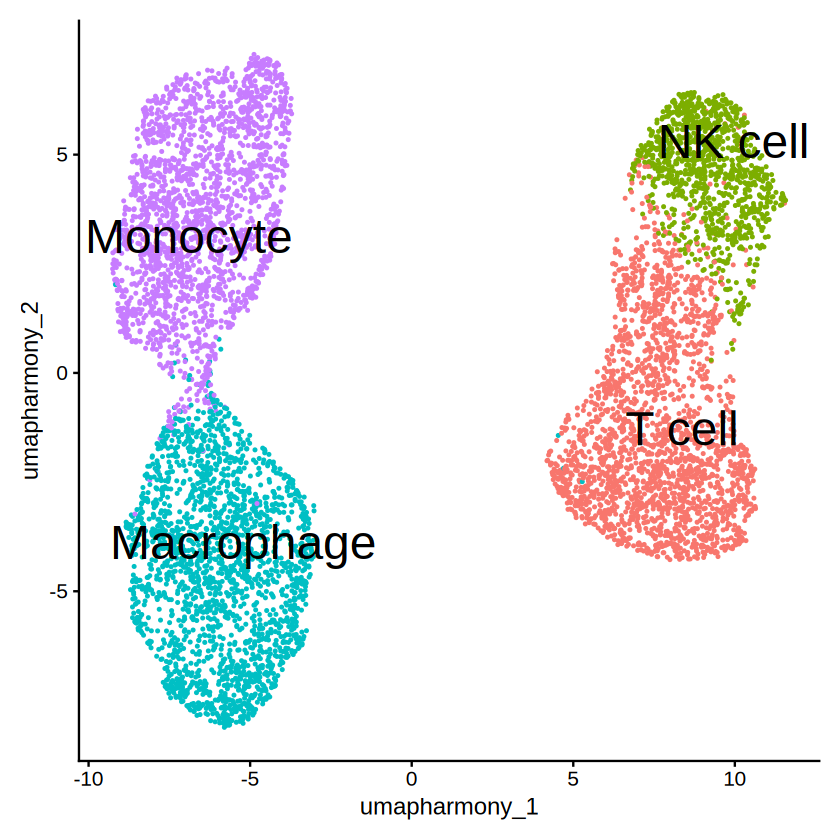
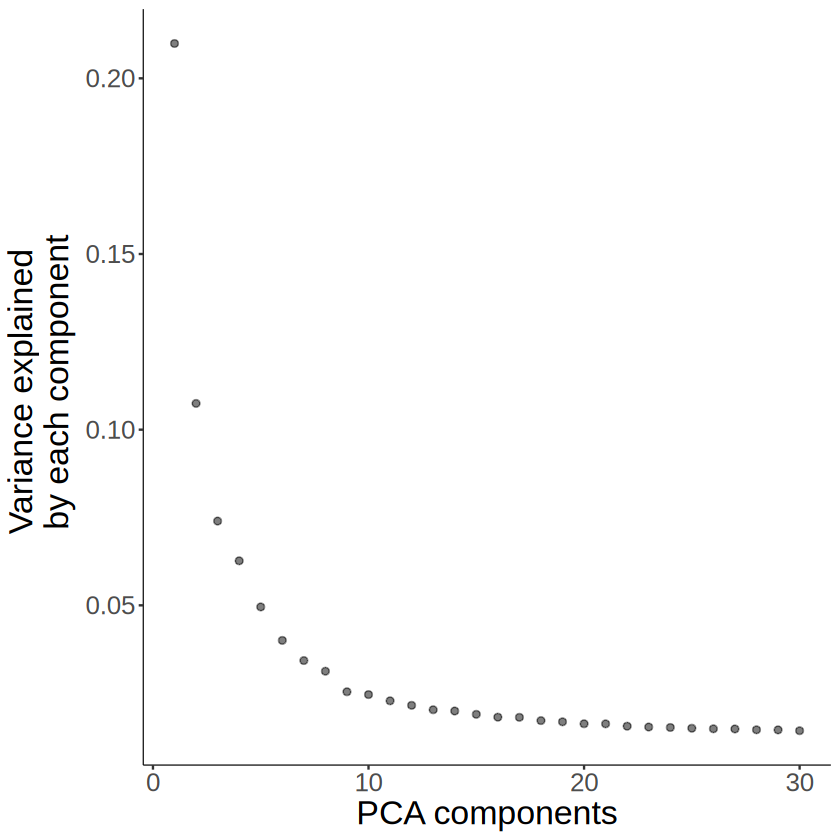
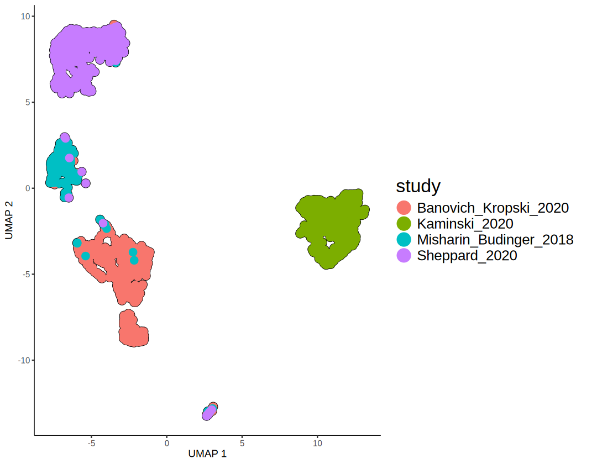
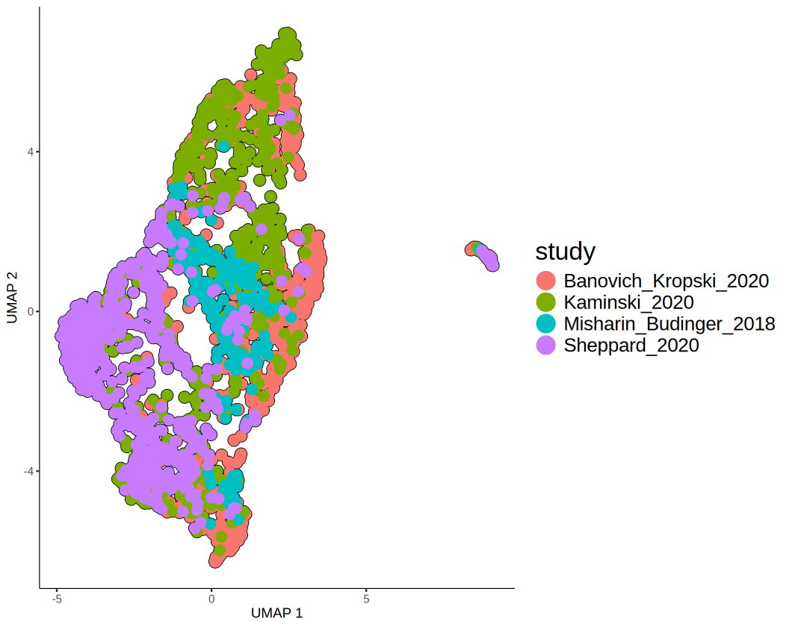
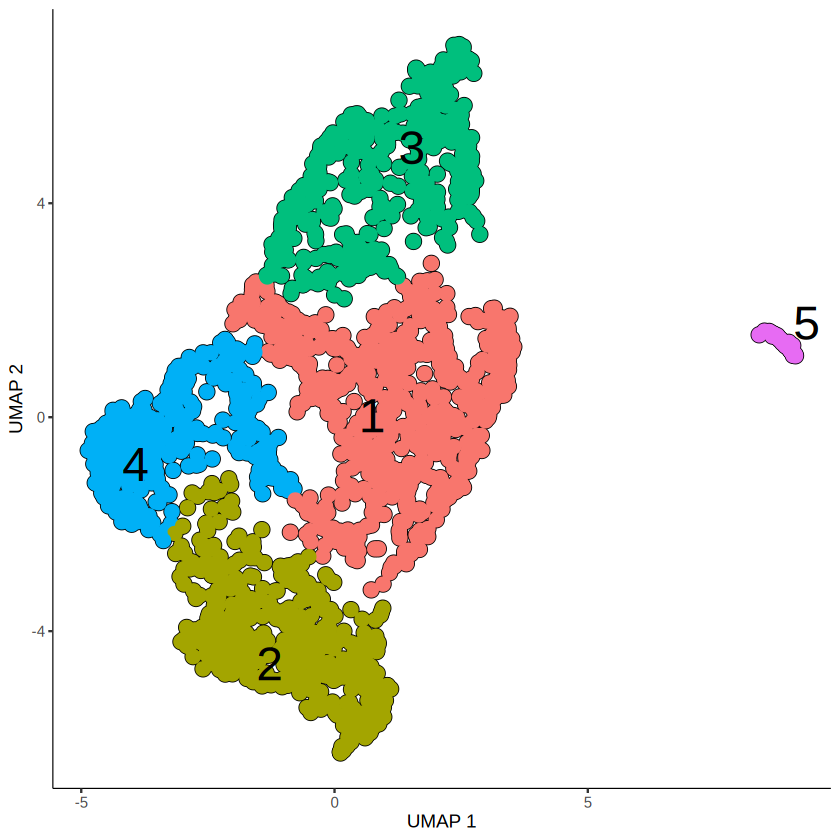
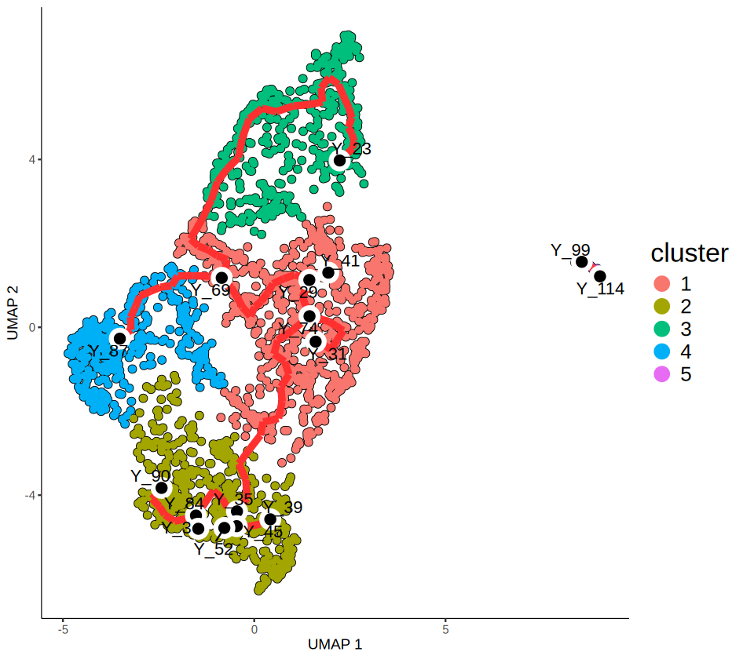
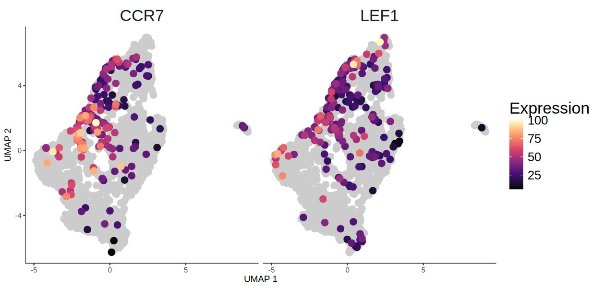
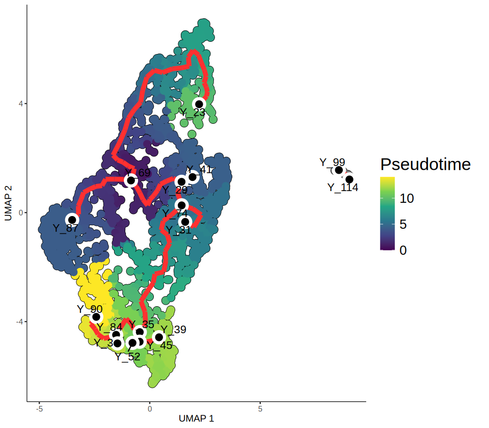
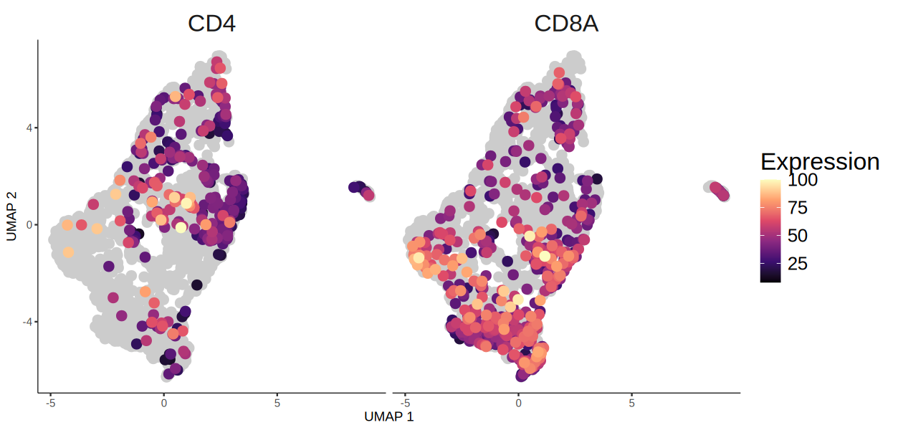
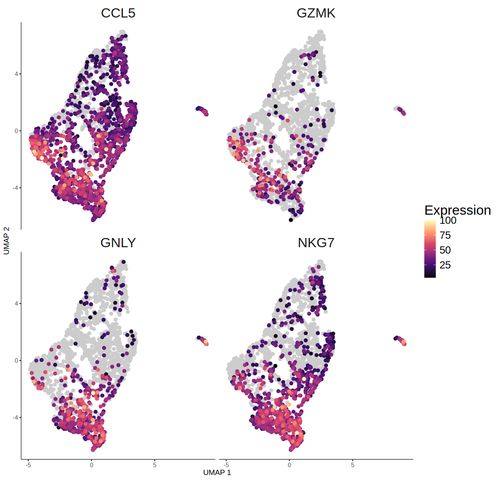

# Monocle3
### 2026-07-21

## Import required libraries


```R
library(Seurat)
library(tidyverse)
library(monocle3)
```

### Configure output directory


```R
OUT <- "monocle"
if (!dir.exists(OUT)) { dir.create(OUT, recursive = TRUE) }
```

### Trajectory analysis using monocle3

##### Here, we describe a brief trajectory analysis of T cell subset using monocle3. The dataset has various celltypes including T cell.


```R
seurat <- readRDS("data/monocle/HLCA_pulmonary_fibrosis_immune_sampled.rds")
seurat
```


    An object of class Seurat 
    19354 features across 7408 samples within 1 assay 
    Active assay: RNA (19354 features, 0 variable features)
     3 layers present: counts, data, scale.data
     4 dimensional reductions calculated: pca, umap, harmony, umap.harmony


```R
options(repr.plot.format = "png", jupyter.plot_mimetypes = c("image/png", "image/jpeg"))
options(repr.plot.width = 7, repr.plot.height = 7)
```


```R
DimPlot(seurat, reduction = "umap.harmony", group.by = "celltype",
    label = TRUE, label.size = 10, repel = TRUE) +
    NoLegend() + ggtitle(NULL)
```


    

    


##### Since we want to draw a trajectory graph of T cells, we will subset only the T cells from the whole dataset.


```R
seurat_t <- seurat[, seurat$celltype == "T cell"]
```


```R
seurat_t[["RNA"]] <- split(seurat_t[["RNA"]], f = seurat_t$study)
seurat_t
```

    Splitting ‘counts’, ‘data’ layers. Not splitting ‘scale.data’. If you would like to split other layers, set in `layers` argument.
    


    An object of class Seurat 
    19354 features across 2166 samples within 1 assay 
    Active assay: RNA (19354 features, 0 variable features)
     9 layers present: counts.Banovich_Kropski_2020, counts.Kaminski_2020, counts.Misharin_Budinger_2018, counts.Sheppard_2020, scale.data, data.Banovich_Kropski_2020, data.Kaminski_2020, data.Misharin_Budinger_2018, data.Sheppard_2020
     4 dimensional reductions calculated: pca, umap, harmony, umap.harmony


```R
seurat_t <- NormalizeData(seurat_t)
seurat_t <- FindVariableFeatures(seurat_t)
```

    Normalizing layer: counts.Banovich_Kropski_2020
    
    Normalizing layer: counts.Kaminski_2020
    
    Normalizing layer: counts.Misharin_Budinger_2018
    
    Normalizing layer: counts.Sheppard_2020
    
    Finding variable features for layer counts.Banovich_Kropski_2020
    
    Finding variable features for layer counts.Kaminski_2020
    
    Finding variable features for layer counts.Misharin_Budinger_2018
    
    Warning message in simpleLoess(y, x, w, span, degree = degree, parametric = parametric, :
    “pseudoinverse used at -2.0952”
    Warning message in simpleLoess(y, x, w, span, degree = degree, parametric = parametric, :
    “neighborhood radius 0.30103”
    Warning message in simpleLoess(y, x, w, span, degree = degree, parametric = parametric, :
    “reciprocal condition number  4.2719e-16”
    Finding variable features for layer counts.Sheppard_2020
    


```R
hvg <- VariableFeatures(seurat_t)
```


```R
seurat_t[["RNA"]] <- JoinLayers(seurat_t[["RNA"]])
```


```R
seurat_t
```


    An object of class Seurat 
    19354 features across 2166 samples within 1 assay 
    Active assay: RNA (19354 features, 2000 variable features)
     3 layers present: data, counts, scale.data
     4 dimensional reductions calculated: pca, umap, harmony, umap.harmony


### Generate CDS object

##### Monocle3 package uses differently structured object named cell_data_set (cds) We recombine the normalized expressions, metadata for cells, and metadata for genes to create the cds object.


```R
cds <- new_cell_data_set(
    expression_data = seurat_t@assays$RNA$data,
    cell_metadata = seurat_t@meta.data,
    gene_metadata = data.frame(
        gene_short_name = row.names(seurat_t),
        row.names = row.names(seurat_t)
        )
    )
cds
```


    class: cell_data_set 
    dim: 19354 2166 
    metadata(1): cds_version
    assays(1): counts
    rownames(19354): A1BG A1CF ... TEC WFS1
    rowData names(1): gene_short_name
    colnames(2166): F01173_GCTGGGTTCCTGTAGA_haberman
      F01172_AGTAGTCGTCCGACGT_haberman ... CGTAGCGCACATTCGA_NML2_tsukui
      CTCAGAATCCTCGCAT_NML3_tsukui
    colData names(10): orig.ident nCount_RNA ... RNA_snn_res.0.3
      Size_Factor
    reducedDimNames(0):
    mainExpName: NULL
    altExpNames(0):


### Dimension reduction for CDS object

##### Monocle3 allows dimension reduction using hvgs. As we import normalized count in cds object, we preprocess the object without additional normalization.


```R
cds <- preprocess_cds(cds, "PCA", num_dim = 30, norm_method = "none", use_genes = hvg)
```

##### We then see the explained variance of each component to select the optimal number of components to use.


```R
options(repr.plot.width = 7, repr.plot.height = 7)
```


```R
plot_pc_variance_explained(cds) +
    theme(
        axis.title = element_text(size = 20),
        axis.text = element_text(size = 15)
        )
```

    Warning message:
    “`qplot()` was deprecated in ggplot2 3.4.0.
    ℹ The deprecated feature was likely used in the monocle3 package.
      Please report the issue to the authors.”
    Warning message:
    “The `size` argument of `element_line()` is deprecated as of ggplot2 3.4.0.
    ℹ Please use the `linewidth` argument instead.
    ℹ The deprecated feature was likely used in the monocle3 package.
      Please report the issue to the authors.”


    

    


```R
cds <- preprocess_cds(cds, "PCA", num_dim = 10, norm_method = "none", use_genes = hvg)
```

### Correcting Batch effects

##### Since the dataset has various sample and batch effects, we perform Mutual Nearest Neighbor (MNN) batch effect correction implemented batchelor, which is included in monocle3 package. The sample ID information is in "study" metadata.


```R
options(repr.plot.width = 9, repr.plot.height = 7)
```


```R
# before batch correction
cds <- reduce_dimension(cds, preprocess_method = "PCA")

plot_cells(cds, color_cells_by = "study",
           show_trajectory_graph = FALSE,
           label_cell_groups = FALSE,
           group_label_size = 10,
           cell_size = 1, cell_stroke = 2) +
    theme(
        legend.title = element_text(size = 20),
        legend.text = element_text(size = 15)
        )
```


    

    


```R
cds <- align_cds(cds, alignment_group = "study")
cds <- reduce_dimension(cds, preprocess_method = "Aligned")
```

    Aligning cells from different batches using Batchelor.
    Please remember to cite:
    	 Haghverdi L, Lun ATL, Morgan MD, Marioni JC (2018). 'Batch effects in single-cell RNA-sequencing data are corrected by matching mutual nearest neighbors.' Nat. Biotechnol., 36(5), 421-427. doi: 10.1038/nbt.4091
    


```R
options(repr.plot.width = 9, repr.plot.height = 7)
```


```R
# after batch correction
plot_cells(cds, color_cells_by = "study",
           show_trajectory_graph = FALSE,
           label_cell_groups = FALSE,
           group_label_size = 10,
           cell_size = 1, cell_stroke = 2) +
    theme(
        legend.title = element_text(size = 20),
        legend.text = element_text(size = 15)
        )
```


    

    


### Cluster cells and learn the trajectory graph

##### After clustering, we will fit a principal graph within each partition using the learn_graph() function.


```R
options(repr.plot.width = 7, repr.plot.height = 7)
```


```R
# clustering
cds <- cluster_cells(cds, resolution = 0.0015)

plot_cells(cds, color_cells_by = "cluster",
           show_trajectory_graph = FALSE,
           group_label_size = 10,
           cell_size = 1, cell_stroke = 2)
ggsave(paste0(OUT, "/monocle_umap-clusters.png"), width = 7, height = 7, dpi = 300)
```

    Warning message:
    “`aes_string()` was deprecated in ggplot2 3.0.0.
    ℹ Please use tidy evaluation idioms with `aes()`.
    ℹ See also `vignette("ggplot2-in-packages")` for more information.
    ℹ The deprecated feature was likely used in the monocle3 package.
      Please report the issue to the authors.”


    

    


```R
# learn graph
cds <- learn_graph(cds)
```

      |======================================================================| 100%


```R
options(repr.plot.width = 8, repr.plot.height = 7)
```


```R
plot_cells(cds, color_cells_by = "cluster",
           show_trajectory_graph = TRUE,
           label_principal_points = TRUE,
           label_cell_groups = FALSE,
           graph_label_size = 3,
           trajectory_graph_color = "firebrick1", trajectory_graph_segment_size = 2,
           cell_size = 1, cell_stroke = 1
          ) +
    theme(
        legend.title = element_text(size = 20),
        legend.text = element_text(size = 15)
    )
```

    Warning message:
    “Using `size` aesthetic for lines was deprecated in ggplot2 3.4.0.
    ℹ Please use `linewidth` instead.
    ℹ The deprecated feature was likely used in the monocle3 package.
      Please report the issue to the authors.”


    

    


### Order cells in pseudotime

##### CCR7 and LEF1 are known as naive T cell marker, so we set the cluster where expression of these genes is high as the root state.


```R
options(repr.plot.width = 10.5, repr.plot.height = 5)
```


```R
plot_cells(cds, genes = c("CCR7", "LEF1"),
           show_trajectory_graph = FALSE,
           label_cell_groups = FALSE,
           graph_label_size = 3,
           cell_size = 1, cell_stroke = 2
          ) +
    labs(color = "Expression") +
    theme(
        strip.text = element_text(size = 20),
        legend.title = element_text(size = 20),
        legend.text = element_text(size = 15)
    ) +
    scale_color_viridis_c(option = "magma")
```

    Scale for colour is already present.
    Adding another scale for colour, which will replace the existing scale.


    

    


```R
# order cells while setting root principal node
cds <- order_cells(cds, root_pr_nodes = "Y_69")
```

Plotting the cells and coloring them by pseudotime shows how they were ordered.


```R
options(repr.plot.width = 8, repr.plot.height = 7)
```


```R
plot_cells(cds, color_cells_by = "pseudotime",
           show_trajectory_graph = TRUE,
           label_principal_points = TRUE, label_leaves = FALSE, label_branch_points = FALSE,
           label_cell_groups = FALSE,
           graph_label_size = 3,
           trajectory_graph_color = "firebrick1", trajectory_graph_segment_size = 2,
           cell_size = 1, cell_stroke = 2
          ) +
    labs(color = "Pseudotime") +
    theme(
        legend.title = element_text(size = 20),
        legend.text = element_text(size = 15)
    ) +
    scale_color_viridis_c(option = "viridis")
```

    Scale for colour is already present.
    Adding another scale for colour, which will replace the existing scale.


    

    


### Check the expression of genes related to t cell function.


```R
options(repr.plot.width = 10.5, repr.plot.height = 5)
```


```R
# CD4+ / CD8+ T cells
plot_cells(cds, genes = c("CD4", "CD8A"),
           show_trajectory_graph = FALSE,
           label_principal_points = TRUE,
           label_cell_groups = FALSE,
           graph_label_size = 3,
           cell_size = 1, cell_stroke = 2
          ) +
    labs(color = "Expression") +
    theme(
        strip.text = element_text(size = 20),
        legend.title = element_text(size = 20),
        legend.text = element_text(size = 15)
    ) +
    scale_color_viridis_c(option = "magma")
```

    Scale for colour is already present.
    Adding another scale for colour, which will replace the existing scale.


    

    


```R
options(repr.plot.width = 10.5, repr.plot.height = 10)
```


```R
# Cytotoxic CD8 T cells
plot_cells(cds, genes = c("CCL5", "GZMK", "GNLY", "NKG7"),
           show_trajectory_graph = FALSE,
           label_principal_points = TRUE,
           label_cell_groups = FALSE,
           graph_label_size = 3,
           cell_size = 1, cell_stroke = 1
          ) +
    labs(color = "Expression") +
    theme(
        strip.text = element_text(size = 20),
        legend.title = element_text(size = 20),
        legend.text = element_text(size = 15)
    ) +
    scale_color_viridis_c(option = "magma")
```

    Scale for colour is already present.
    Adding another scale for colour, which will replace the existing scale.


    

    


### Reference

- Butler, A., Hoffman, P., Smibert, P., Papalexi, E. & Satija, R. Integrating single-cell transcriptomic data across different conditions, technologies, and species. Nat. Biotechnol. 36, 411–420 (2018).

- Cao, J. et al. The single-cell transcriptional landscape of mammalian organogenesis. Nature 566, 496–502 (2019).

- Haghverdi L, Lun ATL, Morgan MD, Marioni JC (2018). 'Batch effects in single-cell RNA-sequencing data are corrected by matching mutual nearest neighbors.' Nat. Biotechnol., 36(5), 421-427. doi: 10.1038/nbt.4091

- L. Ma, M.O. Hernandez, Y. Zhao, M. Mehta, B. Tran, M. Kelly, Z. Rae, J.M. Hernandez, J.L. Davis, S.P. Martin, D.E. Kleiner, S.M. Hewitt, K. Ylaya, B.J. Wood, T.F. Greten, X.W. Wang. Tumor cell biodiversity drives microenvironmental reprogramming in liver cancer. Canc. Cell, 36 (4): 418-430 (2019)

- Sikkema, L., Ramírez-Suástegui, C., Strobl, D.C. et al. An integrated cell atlas of the lung in health and disease. Nat Med 29, 1563–1577 (2023)


    R version 4.5.3 (2026-03-11)
    Platform: x86_64-conda-linux-gnu
    Running under: Ubuntu 24.04.4 LTS
    
    Matrix products: default
    BLAS/LAPACK: /opt/conda/lib/libopenblasp-r0.3.33.so;  LAPACK version 3.12.0
    
    locale:
     [1] LC_CTYPE=C.UTF-8       LC_NUMERIC=C           LC_TIME=C.UTF-8       
     [4] LC_COLLATE=C.UTF-8     LC_MONETARY=C.UTF-8    LC_MESSAGES=C.UTF-8   
     [7] LC_PAPER=C.UTF-8       LC_NAME=C              LC_ADDRESS=C          
    [10] LC_TELEPHONE=C         LC_MEASUREMENT=C.UTF-8 LC_IDENTIFICATION=C   
    
    time zone: Etc/UTC
    tzcode source: system (glibc)
    
    attached base packages:
    [1] stats4    stats     graphics  grDevices utils     datasets  methods  
    [8] base     
    
    other attached packages:
     [1] monocle3_1.4.27             SingleCellExperiment_1.32.0
     [3] SummarizedExperiment_1.40.0 GenomicRanges_1.62.1       
     [5] Seqinfo_1.0.0               IRanges_2.44.0             
     [7] S4Vectors_0.48.1            MatrixGenerics_1.22.0      
     [9] matrixStats_1.5.0           Biobase_2.70.0             
    [11] BiocGenerics_0.56.0         generics_0.1.4             
    [13] lubridate_1.9.5             forcats_1.0.1              
    [15] stringr_1.6.0               dplyr_1.2.1                
    [17] purrr_1.2.2                 readr_2.2.0                
    [19] tidyr_1.3.2                 tibble_3.3.1               
    [21] ggplot2_4.0.3               tidyverse_2.0.0            
    [23] Seurat_5.5.0                SeuratObject_5.4.0         
    [25] sp_2.2-1                   
    
    loaded via a namespace (and not attached):
      [1] RcppAnnoy_0.0.23          splines_4.5.3            
      [3] later_1.4.8               batchelor_1.26.0         
      [5] pbdZMQ_0.3-14             polyclip_1.10-7          
      [7] fastDummies_1.7.6         lifecycle_1.0.5          
      [9] Rdpack_2.6.6              globals_0.19.1           
     [11] lattice_0.22-9            MASS_7.3-65              
     [13] magrittr_2.0.5            plotly_4.12.0            
     [15] httpuv_1.6.17             otel_0.2.0               
     [17] sctransform_0.4.3         spam_2.11-4              
     [19] spatstat.sparse_3.2-0     reticulate_1.46.0        
     [21] cowplot_1.2.0             pbapply_1.7-4            
     [23] minqa_1.2.8               RColorBrewer_1.1-3       
     [25] ResidualMatrix_1.20.0     abind_1.4-8              
     [27] Rtsne_0.17                ggrepel_0.9.8            
     [29] irlba_2.3.7               listenv_1.0.0            
     [31] spatstat.utils_3.2-3      goftest_1.2-3            
     [33] RSpectra_0.16-2           spatstat.random_3.4-5    
     [35] fitdistrplus_1.2-6        parallelly_1.47.0        
     [37] DelayedMatrixStats_1.32.0 codetools_0.2-20         
     [39] DelayedArray_0.36.1       scuttle_1.20.0           
     [41] tidyselect_1.2.1          farver_2.1.2             
     [43] viridis_0.6.5             lme4_2.0-1               
     [45] ScaledMatrix_1.18.0       base64enc_0.1-6          
     [47] spatstat.explore_3.8-0    jsonlite_2.0.0           
     [49] BiocNeighbors_2.4.0       progressr_0.19.0         
     [51] ggridges_0.5.7            survival_3.8-6           
     [53] systemfonts_1.3.2         tools_4.5.3              
     [55] ragg_1.5.2                ica_1.0-3                
     [57] Rcpp_1.1.1-1.1            glue_1.8.1               
     [59] gridExtra_2.3             SparseArray_1.10.10      
     [61] IRdisplay_1.1             withr_3.0.3              
     [63] fastmap_1.2.0             boot_1.3-32              
     [65] rsvd_1.0.5                digest_0.6.39            
     [67] timechange_0.4.0          R6_2.6.1                 
     [69] mime_0.13                 textshaping_1.0.5        
     [71] scattermore_1.2           Cairo_1.7-0              
     [73] tensor_1.5.1              spatstat.data_3.1-9      
     [75] data.table_1.18.4         httr_1.4.8               
     [77] htmlwidgets_1.6.4         S4Arrays_1.10.1          
     [79] uwot_0.2.4                pkgconfig_2.0.3          
     [81] gtable_0.3.6              lmtest_0.9-40            
     [83] S7_0.2.2                  XVector_0.50.0           
     [85] htmltools_0.5.9           dotCall64_1.2            
     [87] scales_1.4.0              png_0.1-9                
     [89] spatstat.univar_3.2-0     reformulas_0.4.4         
     [91] tzdb_0.5.0                reshape2_1.4.5           
     [93] uuid_1.2-2                nlme_3.1-169             
     [95] nloptr_2.2.1              proxy_0.4-29             
     [97] repr_1.1.7                zoo_1.8-15               
     [99] KernSmooth_2.23-26        parallel_4.5.3           
    [101] miniUI_0.1.2              pillar_1.11.1            
    [103] grid_4.5.3                vctrs_0.7.3              
    [105] RANN_2.6.2                promises_1.5.0           
    [107] BiocSingular_1.26.1       beachmat_2.26.0          
    [109] xtable_1.8-8              cluster_2.1.8.2          
    [111] evaluate_1.0.5            cli_3.6.6                
    [113] compiler_4.5.3            rlang_1.2.0              
    [115] crayon_1.5.3              leidenbase_0.1.37        
    [117] future.apply_1.20.2       labeling_0.4.3           
    [119] plyr_1.8.9                stringi_1.8.7            
    [121] viridisLite_0.4.3         deldir_2.0-4             
    [123] BiocParallel_1.44.0       assertthat_0.2.1         
    [125] lazyeval_0.2.3            spatstat.geom_3.8-1      
    [127] Matrix_1.7-5              IRkernel_1.3.2           
    [129] RcppHNSW_0.7.0            hms_1.1.4                
    [131] patchwork_1.3.2           sparseMatrixStats_1.22.0 
    [133] future_1.70.0             shiny_1.14.0             
    [135] rbibutils_2.4.1           ROCR_1.0-12              
    [137] igraph_2.3.2             

