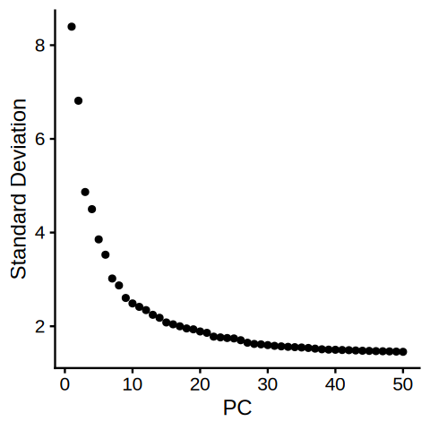
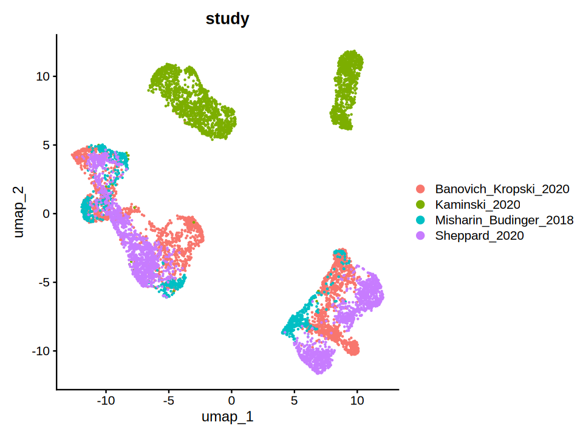
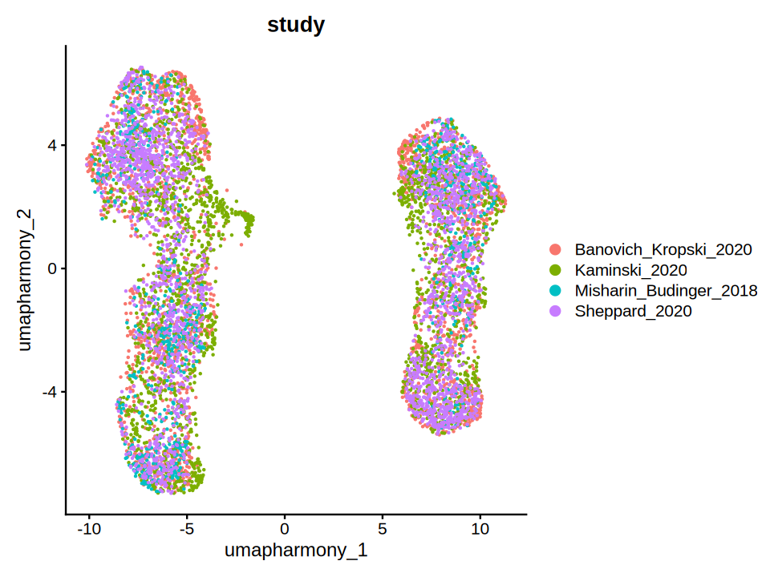
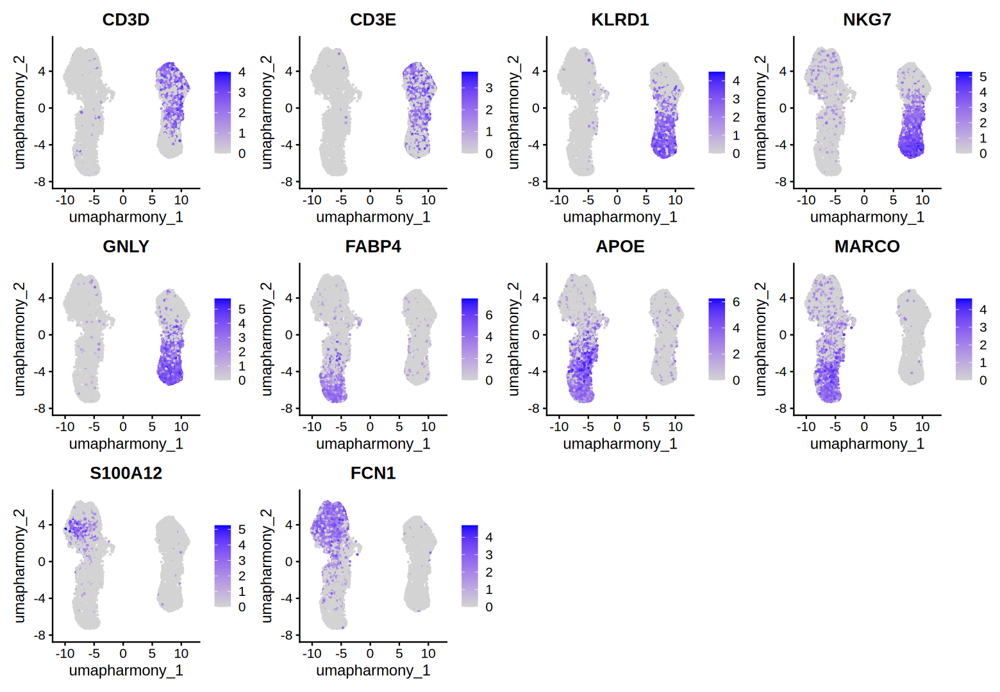
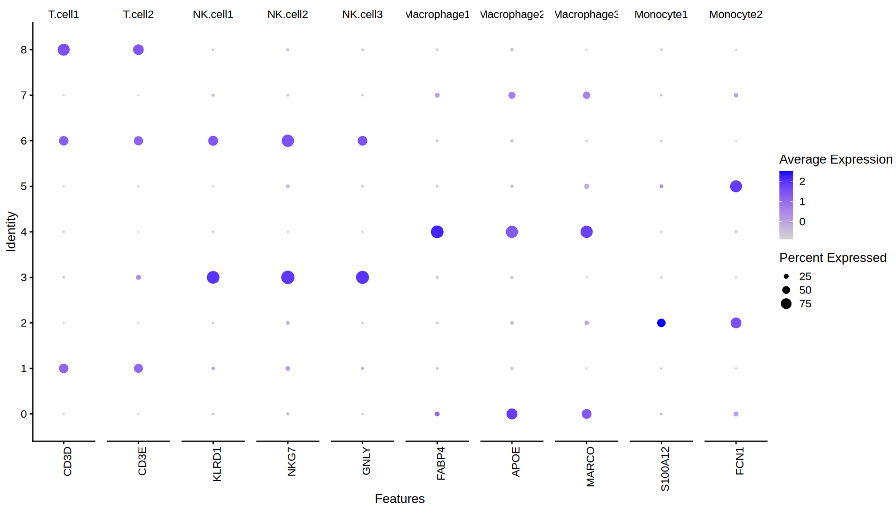
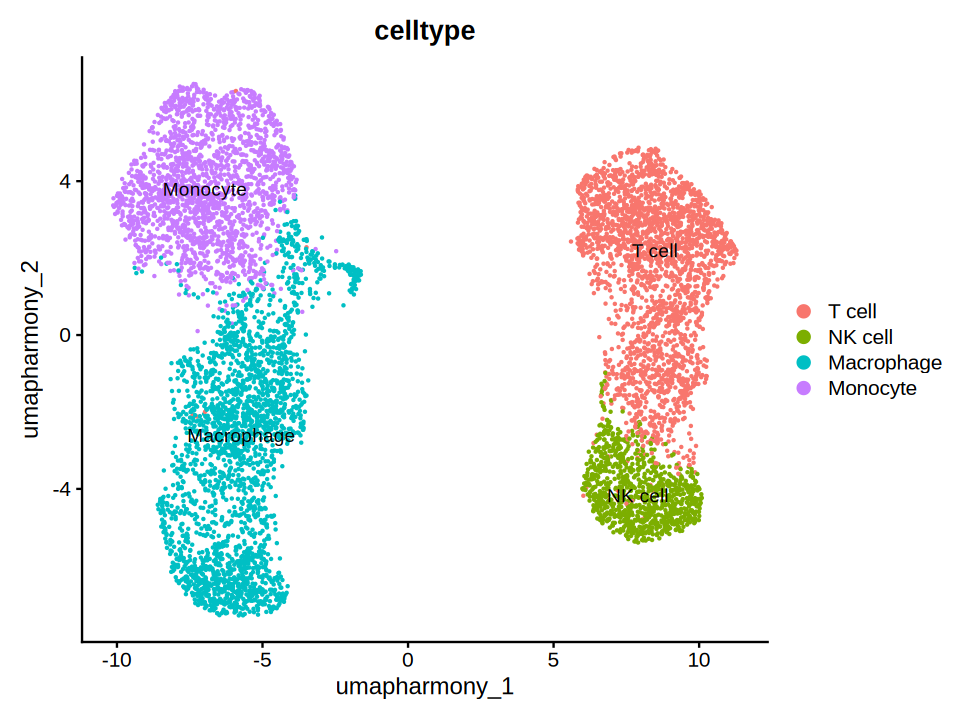
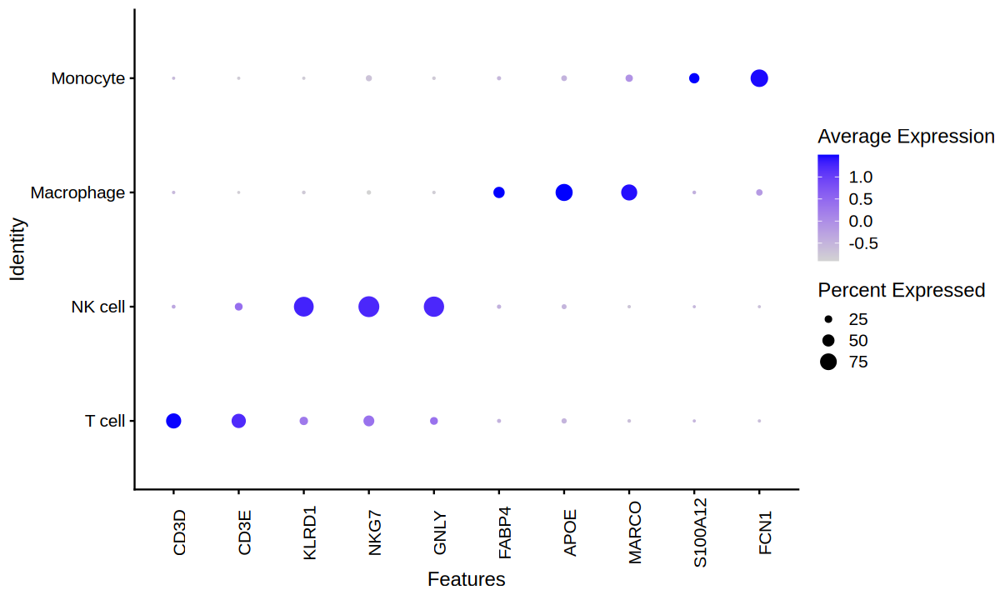
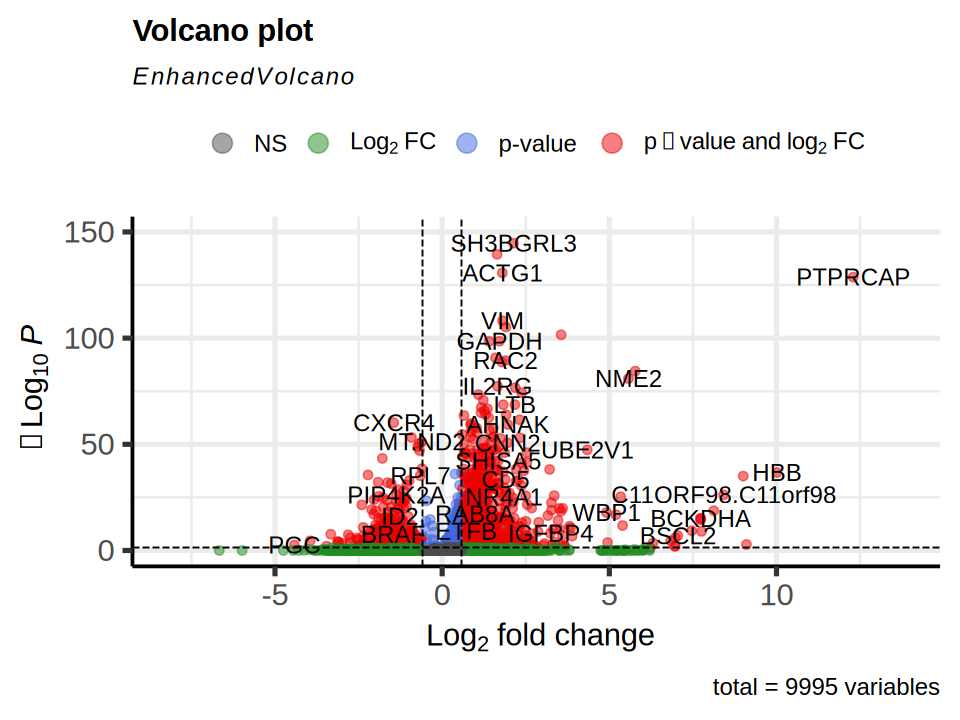
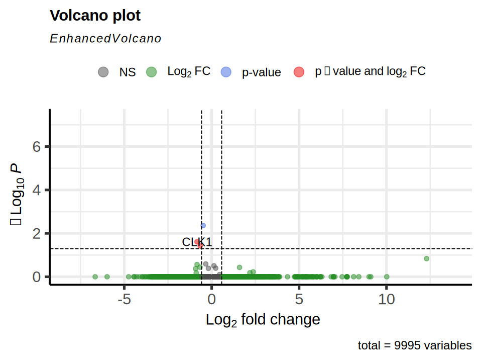

# Basic Pipeline

2025-07-22

```R
library(Seurat)
library(harmony)
library(ggplot2)
set.seed(42) # for reproducibility

save_path = "basic_pipeline"

if (!dir.exists(save_path)) {
  dir.create(save_path, recursive = TRUE)
}
```

## Load data

The data used in this example is from the paper [Sikkema, L. et al. (2023)](https://doi.org/10.1038/s41591-023-02327-2).
This data can be accessed through this [collection](https://cellxgene.cziscience.com/collections/6f6d381a-7701-4781-935c-db10d30de293) on the Cellxgene platform.
In this example however, we will use the sampled version of this data.
Therefore, we set `min.cells` and `min.features` to 0, avoiding any further filtering.

```R
count_matrix <- read.csv("/BiO/data/process/basic_pipeline_data/HLCA_pulmonary_fibrosis_immune_raw.csv", row.names = 1)
meta.data <- read.csv("/BiO/data/process/basic_pipeline_data/HLCA_pulmonary_fibrosis_immune_meta.csv", row.names = 1)

# so stands for 's'eurat 'o'bject 
so <- CreateSeuratObject(counts = count_matrix, meta.data = meta.data, assay = "RNA", min.cells = 0, min.features = 0, project = "HLCA_Pulmonary_Fibrosis_immune")
# genes are in rows, cells are in columns


```

```R
head(so, n = 3)
```

| | orig.ident | nCount_RNA | nFeature_RNA | disease | study |
|---|---|---|---|---|---|
| F01173_GCTGGGTTCCTGTAGA_haberman | HLCA_Pulmonary_Fibrosis_immune | 5525 | 1877 | pulmonary fibrosis | Banovich_Kropski_2020 |
| F00431_CTAGAGTCATGCCACG_haberman | HLCA_Pulmonary_Fibrosis_immune | 2784 | 1017 | pulmonary fibrosis | Banovich_Kropski_2020 |
| F01172_AGTAGTCGTCCGACGT_haberman | HLCA_Pulmonary_Fibrosis_immune | 1617 | 1012 | pulmonary fibrosis | Banovich_Kropski_2020 |

## Normalization

### Seurat style

In seurat, we can perform normalization like below.

```R
so <- NormalizeData(so)
```

```text
Normalizing layer: counts
```

### Scran style

In scran, we first convert the object to a `SingleCellExperiment` object and perform normalization by:

1. clustering cells using `quickCluster()`
2. calculating cell-specific size factors using `computeSumFactors()`
3. dividing counts of each cell by its size factor, and log2-transforming with a pseudocount of 1 using `logNormCounts()`

Then, we convert the `SingleCellExperiment` object back to a `Seurat` object.

```r
library(scran)
library(scater)

sce <- as.SingleCellExperiment(so)

clusters <- quickCluster(sce)
sce <- computeSumFactors(sce, clusters = clusters)
sce.norm <- logNormCounts(sce,  pseudo_count = 1)
so <- as.Seurat(sce.norm, counts = "counts", data = "logcounts")
```

## Batch-aware feature selection

Selecting highly variable genes (HVGs) as a feature set is a common practice in single-cell RNA-seq analysis.
However, this data consists of samples across multiple studies, potentially introducing batch effects.
This kind of across-study batch effect can mask the real biological signal of interest.
To address this, we must take the batch information into account when selecting HVGs.

Here, we'll leverage this batch-aware feature implemented in a python package `scanpy`.

```R
table(so$study)
```

```text
Banovich_Kropski_2020          Kaminski_2020 Misharin_Budinger_2018 
                2338                   2328                    810 
        Sheppard_2020 
                2306 
```

```R
source("/BiO/data/batch_aware_in_seurat.R")

batch_key <- "study"
nHVG <- 2000
batch_aware_in_seurat(so, batch_key = batch_key, nHVG = nHVG, conda_env = "/BiO/prog/miniforge3/envs/QC", save_path = save_path)
HVG <- read.csv(paste0(save_path, "/hvg_", nHVG, "_", batch_key, ".csv"))

head(HVG)
```

| | gene |
|---|---|
| 1 | A2M |
| 2 | ABAT |
| 3 | ABCA1 |
| 4 | ABCA2 |
| 5 | ABCB1 |
| 6 | ABCC4 |

## Dimensionality Reduction

Based on the HVGs selected in the previous step, we can perform dimensionality reduction using PCA.

```R
all.genes <- rownames(so)
so <- ScaleData(so, features = all.genes)

so <- RunPCA(so, features = HVG$gene)
```

```R
ElbowPlot(so, ndims = 50)
```



```R
PCs <- 8

so <- FindNeighbors(so, dims = 1:PCs)
so <- FindClusters(so, resolution = 0.5)

so <- RunUMAP(so, dims = 1:PCs)
# so <- RunTSNE(so, dims = 1:PCs)
```

```R
DimPlot(so, group.by = "study")
```



## Batch Correction by Harmony

We can correct the batch effects using the method from the paper [Korsunsky, I. et al. (2019)](https://doi.org/10.1038/s41592-019-0619-0).
You can find out more about this method in its [documentations](https://portals.broadinstitute.org/harmony/articles/quickstart.html).

```R
so <- RunHarmony(so, "study")
so <- FindNeighbors(so, reduction = "harmony")
so <- FindClusters(so, resolution = 0.5) 
so <- RunUMAP(so, dims = 1:PCs, reduction = "harmony", reduction.name = "umap.harmony") # use same dimension number as before
# so <- RunTSNE(so, dims = 1:PCs, reduction = "harmony", reduction.name = "tsne.harmony")
```

```R
DimPlot(so, group.by = "study", reduction = "umap.harmony")
```



```R
DimPlot(so, group.by = "seurat_clusters", reduction = "umap.harmony", label = TRUE)
```


## Automatic cell type annotation with CellTypist

Traditionally, cell type annotation is done manually by inspecting marker genes by a human expert.
As this process is time and labor intensive, we can use a machine learning based approach to automate this process.

```R
source("/BiO/data/celltypist_in_seurat.R")
celltypist_in_seurat(so, conda_env = "/BiO/prog/miniforge3/envs/QC", save_path = save_path, model_path = "/BiO/data/Immune_All_High.pkl")
```

## Visualize marker gene expression

```R
marker.genes <- list(
    T.cell = c("CD3D", "CD3E"),
    NK.cell = c("KLRD1", "NKG7", "GNLY"),
    Macrophage = c("FABP4", "APOE", "MARCO"),
    Monocyte = c("S100A12", "FCN1")
)

FeaturePlot(so, features = as.vector(unlist(marker.genes)), ncol = 4, reduction = "umap.harmony")
```



```R
DotPlot(so, features = unlist(marker.genes), group.by = "seurat_clusters") +
    theme(axis.text.x = element_text(angle = 90))
```



```R
so$celltype <- as.character(so$seurat_clusters)
so$celltype[so$celltype %in% c(1, 6, 8)] <- "T cell"
so$celltype[so$celltype %in% c(3)] <- "NK cell"
so$celltype[so$celltype %in% c(0, 4, 7)] <- "Macrophage"
so$celltype[so$celltype %in% c(2, 5)] <- "Monocyte"
so$celltype = factor(so$celltype, levels = c("T cell", "NK cell", "Macrophage", "Monocyte"))

DimPlot(so, group.by = "celltype", reduction = "umap.harmony", label = TRUE)
```



```R
DotPlot(so, features = as.vector(unlist(marker.genes)), group.by = "celltype") +
    theme(axis.text.x = element_text(angle = 90))
```



## Selecting patient-aware differentially expressed genes (DEGs)

```R
donor_id <- read.csv("/BiO/data/HLCA_pulmonary_fibrosis_donor_subset.csv", row.names = 1)
so$donor.id <- donor_id[Cells(so), ]
```

```R
library(EnhancedVolcano)

Tcells.control <- Cells(so)[so$celltype == "T cell" & so$disease == "normal"]
Tcells.pulmonary <- Cells(so)[so$celltype == "T cell" & so$disease == "pulmonary fibrosis"]

DEG.vanilla <- FindMarkers(so, ident.1 = Tcells.pulmonary, ident.2 = Tcells.control)
DEG.patient.correction <- FindMarkers(so, ident.1 = Tcells.pulmonary, ident.2 = Tcells.control, test.use = "MAST", latent.vars = "donor.id")
```

```R
EnhancedVolcano(DEG.vanilla, lab = rownames(DEG.vanilla), x = "avg_log2FC", y = "p_val_adj", FCcutoff = log2(1.5), pCutoff = 0.05)
```



```R
EnhancedVolcano(DEG.patient.correction, lab = rownames(DEG.patient.correction), x = "avg_log2FC", y = "p_val_adj", FCcutoff = log2(1.5), pCutoff = 0.05)
```


