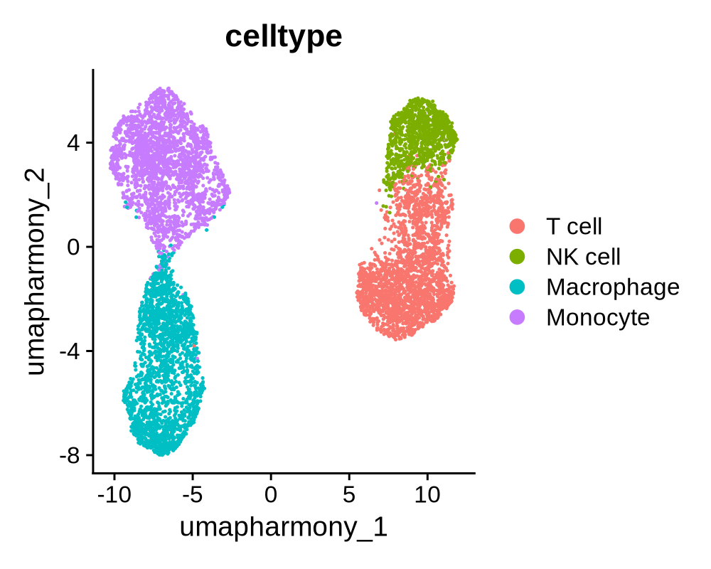
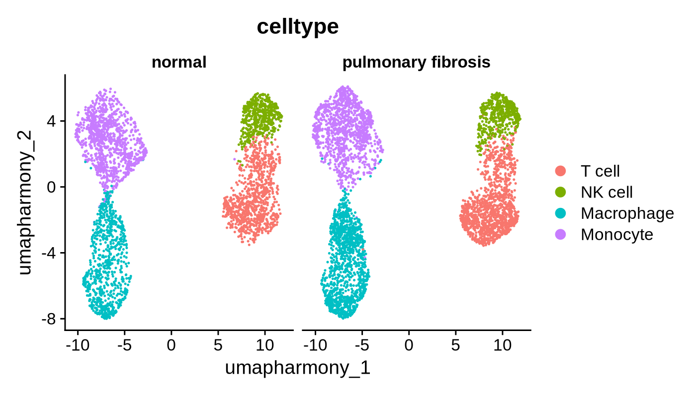
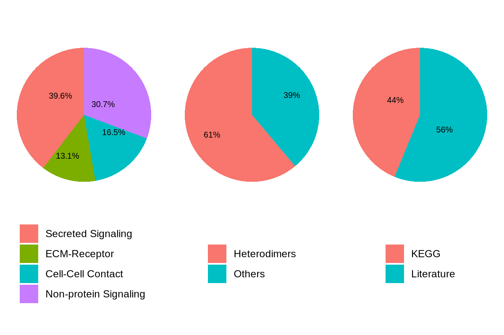
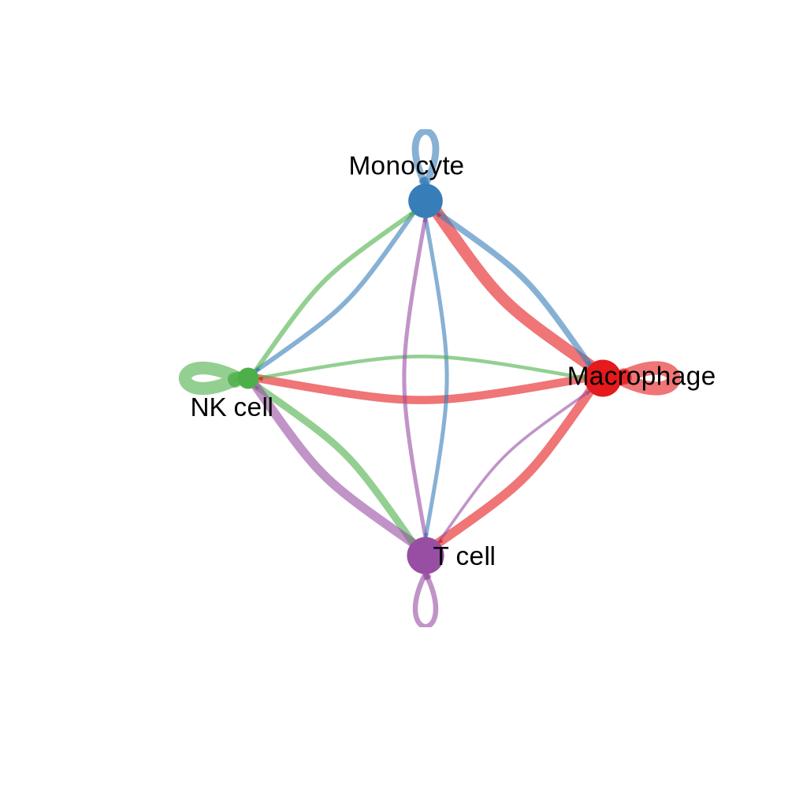
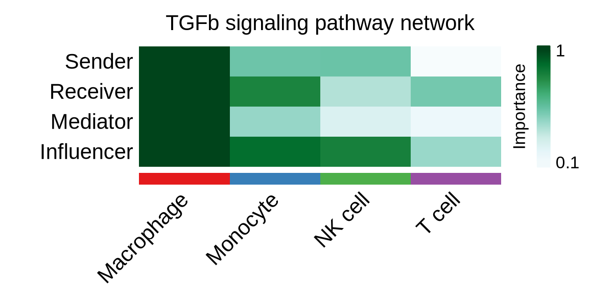
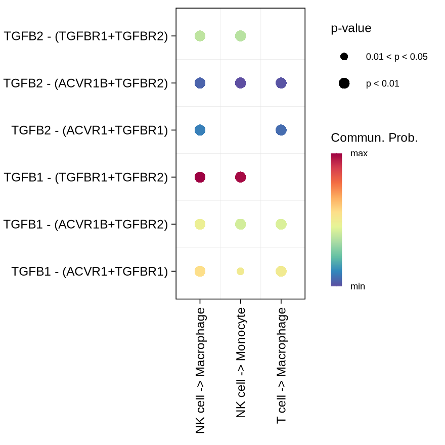
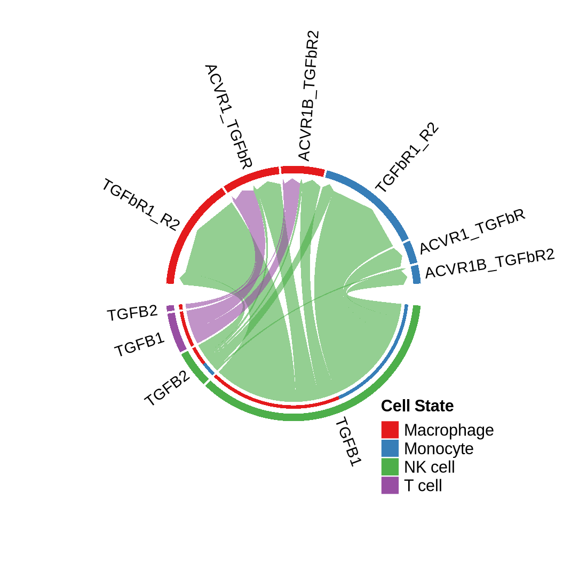
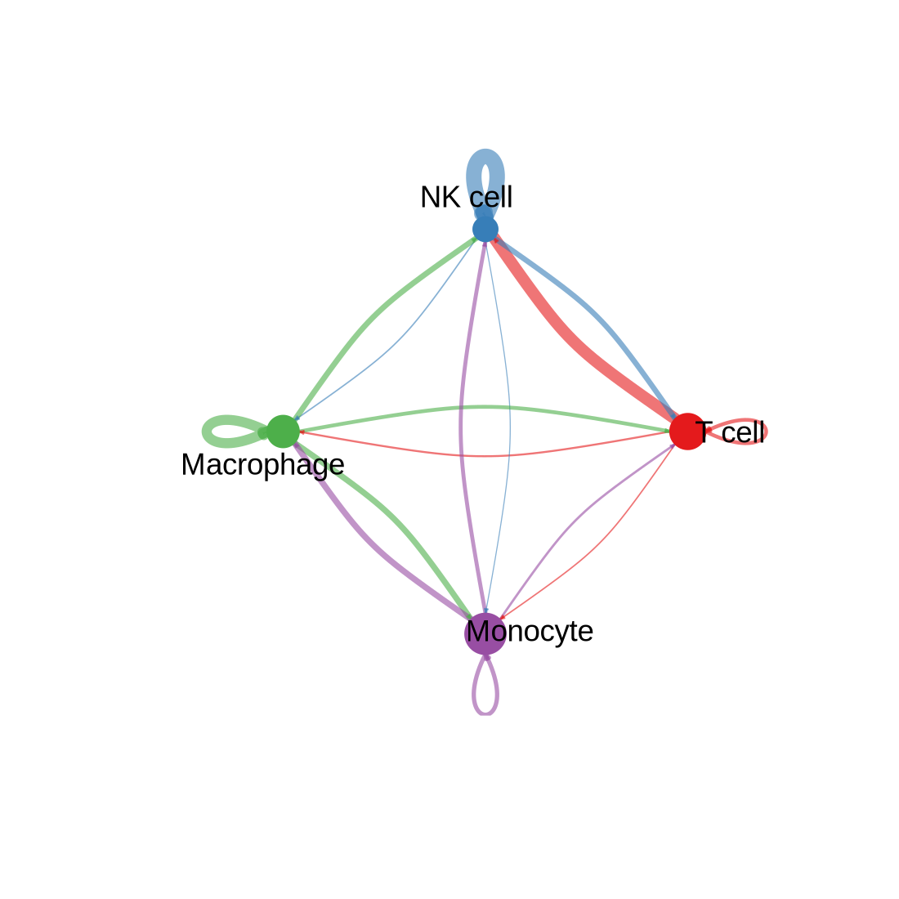
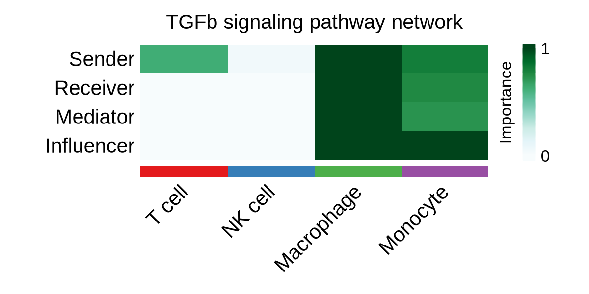

# Cell-Cell Interaction Analysis with CellChat

2025-07-22

## Load required libraries

```R
library(Seurat)
library(CellChat)
```

## Load the Data

```R
seurat <- readRDS("/BiO/data/HLCA_pulmonary_fibrosis_immune.rds")
seurat
```

```text
An object of class Seurat 
19354 features across 7782 samples within 1 assay 
Active assay: RNA (19354 features, 0 variable features)
    3 layers present: counts, data, scale.data
    4 dimensional reductions calculated: pca, umap, harmony, umap.harmony
```

## UMAP visualization

```R
DimPlot(seurat, group.by = 'celltype', reduction = "umap.harmony")
```



```R
DimPlot(seurat, group.by = 'celltype', reduction = "umap.harmony", split.by = "disease")
```



## Input data processing

### 1-1. Create CellChat object from Seurat object

```R
seurat_PF <- subset(seurat, subset = disease == "pulmonary fibrosis")
cellchat_PF <- createCellChat(object = seurat_PF, group.by = "celltype", assay = "RNA")
```

### 1-2. Create CellChat object from expression matrix and metadata

```R
expr <- seurat[["RNA"]]$data
meta <- seurat@meta.data

cells_PF <- rownames(meta)[meta$disease == "pulmonary fibrosis"]

expr_PF <- expr[, cells_PF]
meta_PF <- meta[cells_PF,]
meta_PF$celltype <- as.character(meta_PF$celltype)

cellchat_PF <- createCellChat(object = expr_PF, meta = meta_PF, group.by = "celltype")
```

### 2. Set the ligand-receptor interaction database

```R
options(repr.plot.width = 6, repr.plot.height = 4, repr.plot.res = 200)
```

```R
CellChatDB <- CellChatDB.human # use CellChatDB.mouse if running on mouse data
showDatabaseCategory(CellChatDB)
```



### 3. Subset the expression data using CellChatDB genes

```R
cellchat_PF@DB <- CellChatDB
cellchat_PF <- subsetData(cellchat_PF)
```

### 4. Identify over-expressed ligands/receptors and L-R interactions in each cell group

```R
cellchat_PF <- identifyOverExpressedGenes(cellchat_PF)
cellchat_PF <- identifyOverExpressedInteractions(cellchat_PF)
```

```text
The number of highly variable ligand-receptor pairs used for signaling inference is 874 
```

### 5. (Optional) Smooth the gene expression because of shallow sequencing depth

```R
cellchat_PF <- smoothData(cellchat_PF, adj = PPI.human)
```

## Inference of cell-cell communication networks

### 1. Compute the communication probability

```R
cellchat_PF <- computeCommunProb(cellchat_PF, raw.use = FALSE) # Set raw.use = FALSE to use the smoothed data
```

```text
triMean is used for calculating the average gene expression per cell group. 
[1] ">>> Run CellChat on sc/snRNA-seq data <<< [2025-07-19 21:35:12.929313]"
[1] ">>> CellChat inference is done. Parameter values are stored in `object@options$parameter` <<< [2025-07-19 21:37:13.143503]"
```

### 2. Filter the cell-cell interaction, based on the number of cells in each group

```R
cellchat_PF <- filterCommunication(cellchat_PF, min.cells = 0)
```

### 3. Extract the inferred cellular communication network as a data frame

```R
df_net_PF <- subsetCommunication(cellchat_PF)
head(df_net_PF)
```

| | source | target | ligand | receptor | prob | pval | interaction_name | interaction_name_2 | pathway_name | annotation | evidence |
|-|--------|--------|--------|----------|------|------|------------------|-------------------|--------------|------------|-----------|
|1| Macrophage | Macrophage | TGFB1 | TGFbR1_R2 | 0.001770137 | 0.00 | TGFB1_TGFBR1_TGFBR2 | TGFB1 - (TGFBR1+TGFBR2) | TGFb | Secreted Signaling | KEGG: hsa04350 |
|2| Monocyte | Macrophage | TGFB1 | TGFbR1_R2 | 0.001466371 | 0.00 | TGFB1_TGFBR1_TGFBR2 | TGFB1 - (TGFBR1+TGFBR2) | TGFb | Secreted Signaling | KEGG: hsa04350 |
|3| NK cell | Macrophage | TGFB1 | TGFbR1_R2 | 0.001517727 | 0.00 | TGFB1_TGFBR1_TGFBR2 | TGFB1 - (TGFBR1+TGFBR2) | TGFb | Secreted Signaling | KEGG: hsa04350 |
|4| Macrophage | Monocyte | TGFB1 | TGFbR1_R2 | 0.001699504 | 0.00 | TGFB1_TGFBR1_TGFBR2 | TGFB1 - (TGFBR1+TGFBR2) | TGFb | Secreted Signaling | KEGG: hsa04350 |
|5| Monocyte | Monocyte | TGFB1 | TGFbR1_R2 | 0.001407818 | 0.01 | TGFB1_TGFBR1_TGFBR2 | TGFB1 - (TGFBR1+TGFBR2) | TGFb | Secreted Signaling | KEGG: hsa04350 |
|6| NK cell | Monocyte | TGFB1 | TGFbR1_R2 | 0.001457154 | 0.01 | TGFB1_TGFBR1_TGFBR2 | TGFB1 - (TGFBR1+TGFBR2) | TGFb | Secreted Signaling | KEGG: hsa04350 |

### 4. Infer the cell-cell communication at a signaling pathway level

```R
cellchat_PF <- computeCommunProbPathway(cellchat_PF)
```

### 5. Calculate the aggregated cell-cell communication network

```R
cellchat_PF <- aggregateNet(cellchat_PF)
```

### 6. Save the CellChat object

```R
saveRDS(cellchat_PF, file = "cellchat_lung_PF.rds")
```

## Visualization

### Circle plot

```R
groupSize_PF <- as.numeric(table(cellchat_PF@idents))
plot <- netVisual_circle(cellchat_PF@net$weight, vertex.weight = groupSize_PF, weight.scale = T, label.edge= F)
```



## Identify signaling roles and major contributing signaling

### 1. Compute the network centrality scores

```R
cellchat_PF <- netAnalysis_computeCentrality(cellchat_PF, slot.name = "netP")
```

### 2. Visualization

```R
pathways.show <- "TGFb"
netAnalysis_signalingRole_network(cellchat_PF, signaling = pathways.show, width = 6, height = 2, font.size = 10)
```



```R
netVisual_bubble(cellchat_PF, sources.use = c(3:4), targets.use = c(1:2), signaling = c("TGFb"), remove.isolate = TRUE) +
    theme(plot.margin = margin(5, 5, 5, 10)) # prevent y-axis label clipping
```



```R
plot <- netVisual_chord_gene(cellchat_PF, sources.use = c(3:4), targets.use = c(1:2), signaling = c("TGFb"))
```



## Process same process for normal group

### 1. Input data processing & Running CellChat

```R
seurat_NM <- subset(seurat, subset = disease == "normal")
cellchat_NM <- createCellChat(object = seurat_NM, group.by = "celltype", assay = "RNA")

cellchat_NM@DB <- CellChatDB

cellchat_NM <- subsetData(cellchat_NM)

cellchat_NM <- identifyOverExpressedGenes(cellchat_NM)
cellchat_NM <- identifyOverExpressedInteractions(cellchat_NM)

cellchat_NM <- smoothData(cellchat_NM, adj = PPI.human)

cellchat_NM <- computeCommunProb(cellchat_NM, raw.use = FALSE)
cellchat_NM <- filterCommunication(cellchat_NM, min.cells = 0)
cellchat_NM <- computeCommunProbPathway(cellchat_NM)
cellchat_NM <- aggregateNet(cellchat_NM)
```

### 2. Visualization

```R
groupSize_NM <- as.numeric(table(cellchat_NM@idents))
plt <- netVisual_circle(cellchat_NM@net$weight, vertex.weight = groupSize_NM,
                 weight.scale = T, label.edge= F, title.name = "Interaction weights/strength")
```



```R
# Compute centrality
cellchat_NM <- netAnalysis_computeCentrality(cellchat_NM, slot.name = "netP")

pathways.show <- "TGFb"
netAnalysis_signalingRole_network(cellchat_NM, signaling = pathways.show, width = 6, height = 2, font.size = 10)
```



## Reference

Jin, S., Guerrero-Juarez, C. F., Zhang, L., Chang, I., Ramos, R., Kuan, C. H., … & Nie, Q. (2021). Inference and analysis of cell-cell communication using CellChat. Nature communications, 12(1), 1-20.

Jin, S., Plikus, M.V. & Nie, Q. (2025). CellChat for systematic analysis of cell–cell communication from single-cell transcriptomics. Nat Protoc, 20, 180–219.

Sikkema, L., Ramírez-Suástegui, C., Strobl, D.C., … & Theis, F.J. (2023). An integrated cell atlas of the lung in health and disease. Nat Med, 29, 1563–1577.
