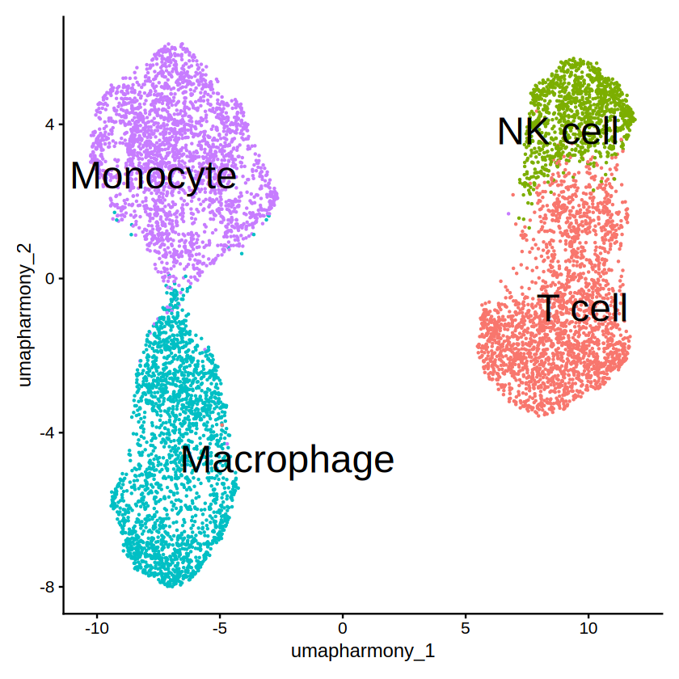
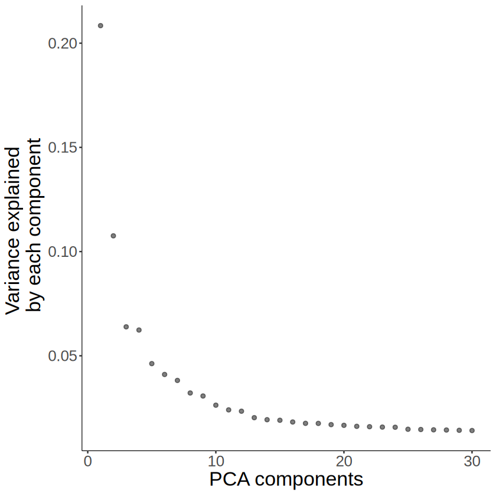
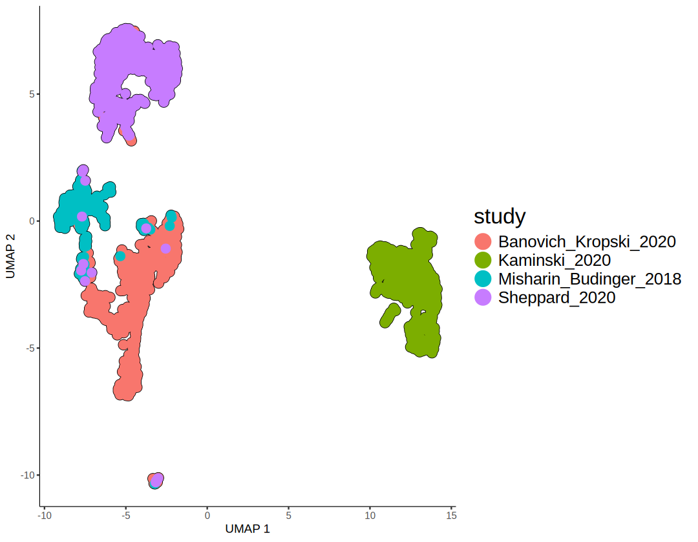
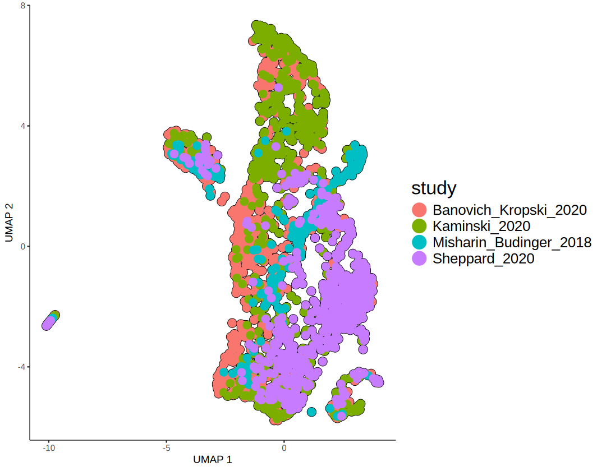
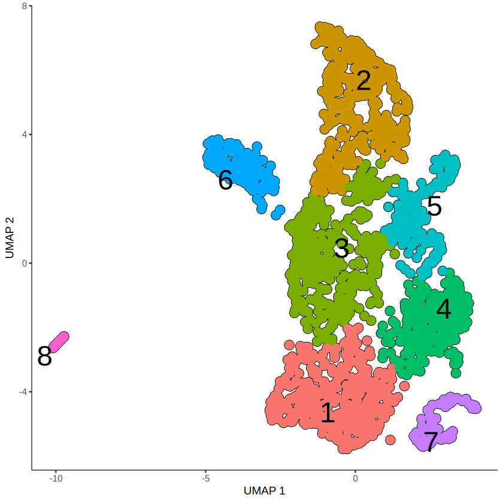
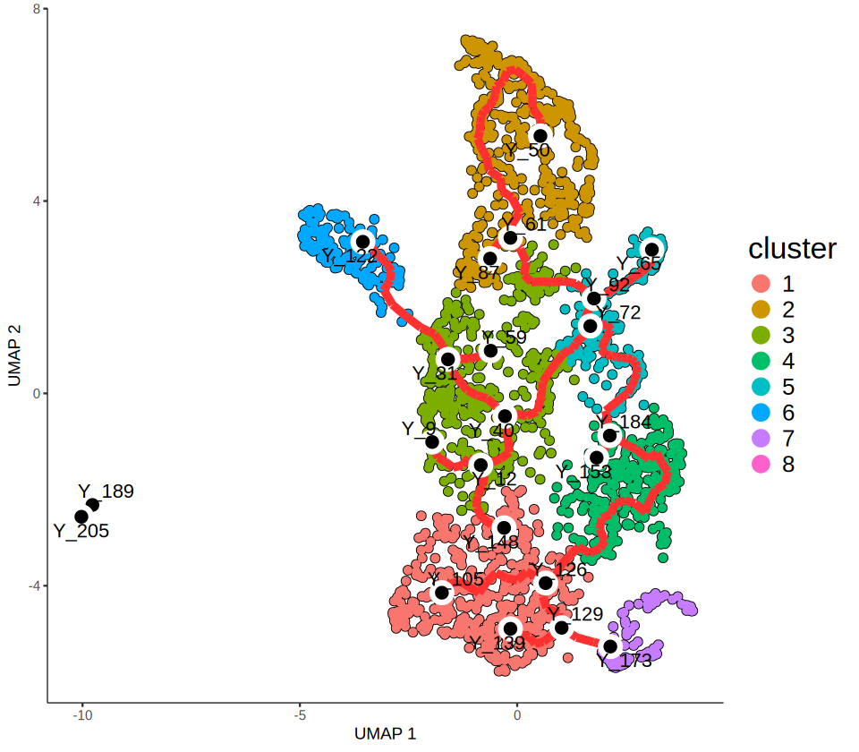
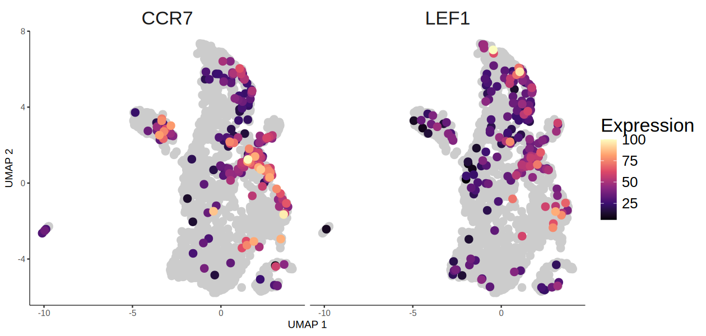
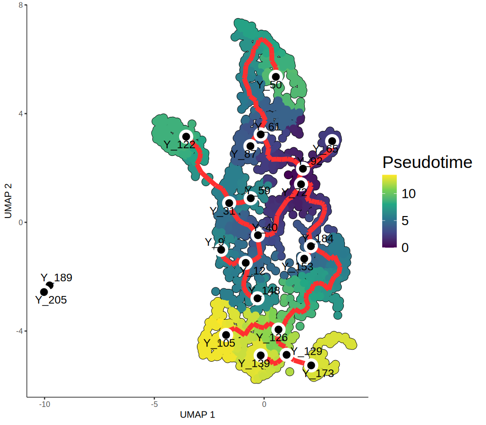
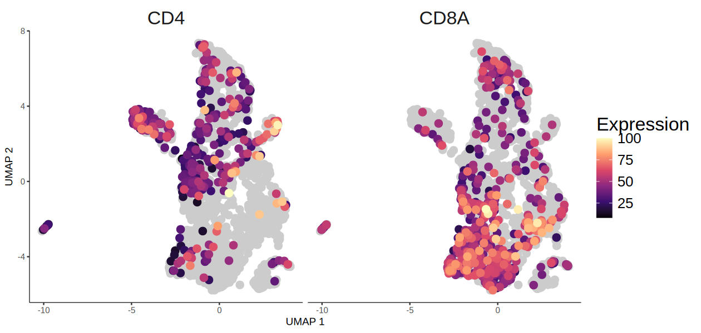
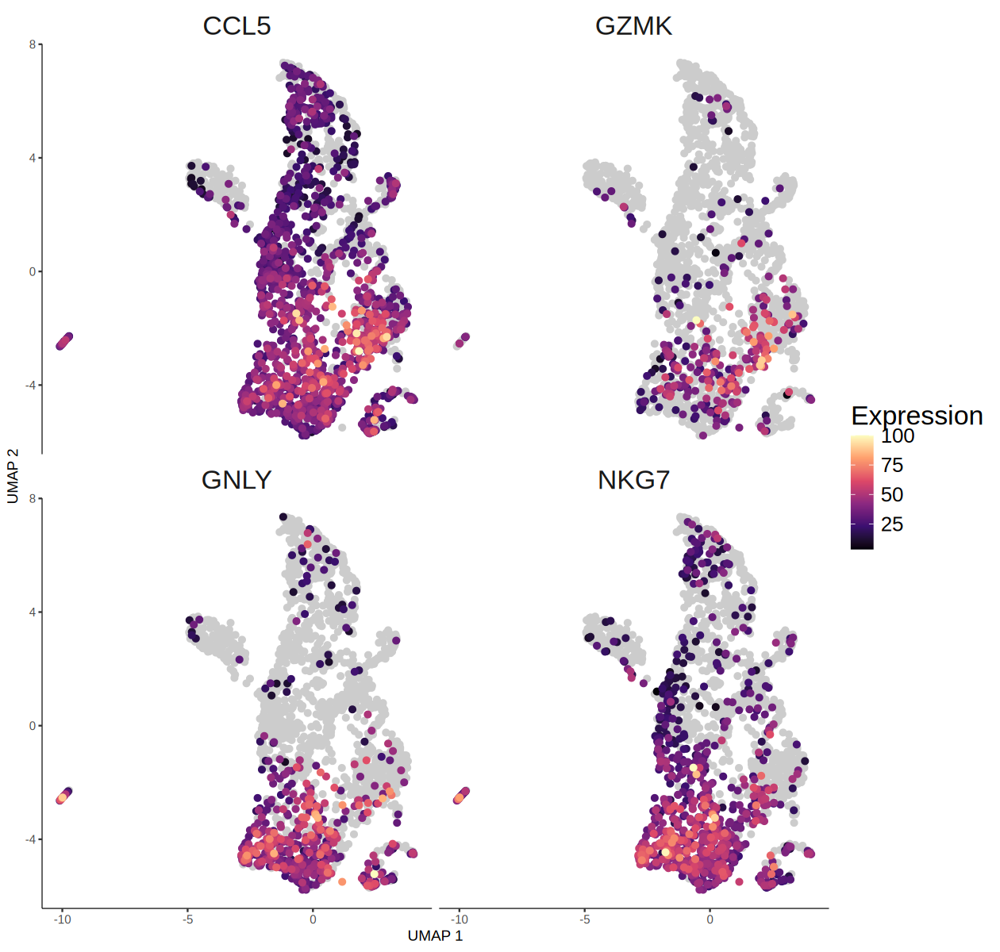

# Monocle3

2025-07-22

## Import required libraries

```R
library(Seurat)
library(tidyverse)
library(monocle3)
```

## Configure output directory

```R
OUT = "./monocle-outputs"
if (!dir.exists(OUT)) { dir.create(OUT, recursive = TRUE) }
```

## Trajectory analysis using monocle3

Here, we describe a brief trajectory analysis of T cell subset using monocle3.
The dataset has various celltypes including T cell.

```R
seurat <- readRDS("/BiO/data/HLCA_pulmonary_fibrosis_immune.rds")
seurat
```

```text
    An object of class Seurat 
    19354 features across 7782 samples within 1 assay 
    Active assay: RNA (19354 features, 0 variable features)
     3 layers present: counts, data, scale.data
     4 dimensional reductions calculated: pca, umap, harmony, umap.harmony
```

```R
DimPlot(seurat, reduction = "umap.harmony", group.by = "celltype",
    label = TRUE, label.size = 10, repel = TRUE) +
    NoLegend() + ggtitle(NULL)
```



Since we want to draw a trajectory graph of T cells, we will subset only the T cells from the whole dataset and re-normalize.

```R
seurat_t <- seurat[, seurat$celltype == "T cell"]
# normalization
seurat_t <- NormalizeData(seurat_t)
```

```R
hvg <- SelectIntegrationFeatures(
    object.list = SplitObject(seurat_t, split.by = "study"),
    assay = c("RNA", "RNA", "RNA", "RNA"),
    nfeatures = 2000, fvf.nfeatures = 2000
)
VariableFeatures(seurat_t) <- hvg
```

### Generate CDS object

Monocle3 package uses differently structured object named cell_data_set (cds)
We recombine the normalized expressions, metadata for cells, and metadata for genes to create the cds object.

```R
cds <- new_cell_data_set(
    expression_data = seurat_t@assays$RNA$data,
    cell_metadata = seurat_t@meta.data,
    gene_metadata = data.frame(
        gene_short_name = row.names(seurat_t),
        row.names = row.names(seurat_t)
        )
    )
cds
```

```text
    class: cell_data_set 
    dim: 19354 2268 
    metadata(1): cds_version
    assays(1): counts
    rownames(19354): A1BG A1CF ... TEC WFS1
    rowData names(1): gene_short_name
    colnames(2268): F01173_GCTGGGTTCCTGTAGA_haberman
      F01172_AGTAGTCGTCCGACGT_haberman ... CGTAGCGCACATTCGA_NML2_tsukui
      CTCAGAATCCTCGCAT_NML3_tsukui
    colData names(10): orig.ident nCount_RNA ... celltype Size_Factor
    reducedDimNames(0):
    mainExpName: NULL
    altExpNames(0):
```

### Dimension reduction for CDS object

Monocle3 allows dimension reduction using hvgs. As we import normalized count in cds object, we preprocess the object without additional normalization.

```R
cds <- preprocess_cds(cds, "PCA", num_dim = 30, norm_method = "none", use_genes = hvg)
```

We then see the explained variance of each component to select the optimal number of components to use

```R
plot_pc_variance_explained(cds) +
    theme(
        axis.title = element_text(size = 20),
        axis.text = element_text(size = 15)
        )
```



```R
cds <- preprocess_cds(cds, "PCA", num_dim = 10, norm_method = "none", use_genes = hvg)
```

### Correcting Batch effects

Since the dataset has various sample and batch effects, we perform Mutual Nearest Neighbor (MNN) batch effect correction implemented batchelor, which is included in monocle3 package.
The sample ID information is in "study" metadata.

```R
# before batch correction
cds <- reduce_dimension(cds, preprocess_method = "PCA")

plot_cells(cds, color_cells_by = "study",
           show_trajectory_graph = FALSE,
           label_cell_groups = FALSE,
           group_label_size = 10,
           cell_size = 1, cell_stroke = 2) +
    theme(
        legend.title = element_text(size = 20),
        legend.text = element_text(size = 15)
        )
```



```R
cds <- align_cds(cds, alignment_group = "study")
cds <- reduce_dimension(cds, preprocess_method = "Aligned")
```

```R
# after batch correction
plot_cells(cds, color_cells_by = "study",
           show_trajectory_graph = FALSE,
           label_cell_groups = FALSE,
           group_label_size = 10,
           cell_size = 1, cell_stroke = 2) +
    theme(
        legend.title = element_text(size = 20),
        legend.text = element_text(size = 15)
        )

```



### Cluster cells and learn the trajectory graph

After clustering, we will fit a principal graph within each partition using the learn_graph() function.

```R
# clustering
cds <- cluster_cells(cds, resolution = 0.0015)

plot_cells(cds, color_cells_by = "cluster",
           show_trajectory_graph = FALSE,
           group_label_size = 10,
           cell_size = 1, cell_stroke = 2)
ggsave(paste0(OUT, "/monocle_umap-clusters.png"), width = 7, height = 7, dpi = 300)
```



```R
# learn graph
cds = learn_graph(cds)
```

```R
plot_cells(cds, color_cells_by = "cluster",
           show_trajectory_graph = TRUE,
           label_principal_points = TRUE,
           label_cell_groups = FALSE,
           graph_label_size = 3,
           trajectory_graph_color = "firebrick1", trajectory_graph_segment_size = 2,
           cell_size = 1, cell_stroke = 1
          ) +
    theme(
        legend.title = element_text(size = 20),
        legend.text = element_text(size = 15)
    )
```



### Order cells in pseudotime

CCR7 and LEF1 are known as naive T cell marker, so we set the cluster where expression of these genes is high as the root state.

```R
plot_cells(cds, genes = c("CCR7", "LEF1"),
           show_trajectory_graph = FALSE,
           label_cell_groups = FALSE,
           graph_label_size = 3,
           cell_size = 1, cell_stroke = 2
          ) +
    labs(color = "Expression") +
    theme(
        strip.text = element_text(size = 20),
        legend.title = element_text(size = 20),
        legend.text = element_text(size = 15)
    ) +
    scale_color_viridis_c(option = "magma")
```



```R
# order cells while setting root principal node
cds <- order_cells(cds, root_pr_nodes = "Y_72")
```

Plotting the cells and coloring them by pseudotime shows how they were ordered.

```R
options(repr.plot.width = 8, repr.plot.height = 7)
```

```R
plot_cells(cds, color_cells_by = "pseudotime",
           show_trajectory_graph = TRUE,
           label_principal_points = TRUE, label_leaves = FALSE, label_branch_points = FALSE,
           label_cell_groups = FALSE,
           graph_label_size = 3,
           trajectory_graph_color = "firebrick1", trajectory_graph_segment_size = 2,
           cell_size = 1, cell_stroke = 2
          ) +
    labs(color = "Pseudotime") +
    theme(
        legend.title = element_text(size = 20),
        legend.text = element_text(size = 15)
    ) +
    scale_color_viridis_c(option = "viridis")
```



Check the expression of genes related to t cell function.

```R
# CD4+ / CD8+ T cells
plot_cells(cds, genes = c("CD4", "CD8A"),
           show_trajectory_graph = FALSE,
           label_principal_points = TRUE,
           label_cell_groups = FALSE,
           graph_label_size = 3,
           cell_size = 1, cell_stroke = 2
          ) +
    labs(color = "Expression") +
    theme(
        strip.text = element_text(size = 20),
        legend.title = element_text(size = 20),
        legend.text = element_text(size = 15)
    ) +
    scale_color_viridis_c(option = "magma")
```



```R
options(repr.plot.width = 10.5, repr.plot.height = 10)
```

```R
# Cytotoxic CD8 T cells
plot_cells(cds, genes = c("CCL5", "GZMK", "GNLY", "NKG7"),
           show_trajectory_graph = FALSE,
           label_principal_points = TRUE,
           label_cell_groups = FALSE,
           graph_label_size = 3,
           cell_size = 1, cell_stroke = 1
          ) +
    labs(color = "Expression") +
    theme(
        strip.text = element_text(size = 20),
        legend.title = element_text(size = 20),
        legend.text = element_text(size = 15)
    ) +
    scale_color_viridis_c(option = "magma")
```



## Reference

Butler, A., Hoffman, P., Smibert, P., Papalexi, E. & Satija, R. Integrating single-cell transcriptomic data across different conditions, technologies, and species. Nat. Biotechnol. 36, 411-420 (2018).

Cao, J. et al. The single-cell transcriptional landscape of mammalian organogenesis. Nature 566, 496-502 (2019).

Haghverdi L, Lun ATL, Morgan MD, Marioni JC (2018). 'Batch effects in single-cell RNA-sequencing data are corrected by matching mutual nearest neighbors.' Nat. Biotechnol., 36(5), 421-427. doi: 10.1038/nbt.4091

L. Ma, M.O. Hernandez, Y. Zhao, M. Mehta, B. Tran, M. Kelly, Z. Rae, J.M. Hernandez, J.L. Davis, S.P. Martin, D.E. Kleiner, S.M. Hewitt, K. Ylaya, B.J. Wood, T.F. Greten, X.W. Wang. Tumor cell biodiversity drives microenvironmental reprogramming in liver cancer. Canc. Cell, 36 (4): 418-430 (2019)

Sikkema, L., Ramírez-Suástegui, C., Strobl, D.C. et al. An integrated cell atlas of the lung in health and disease. Nat Med 29, 1563-1577 (2023)
